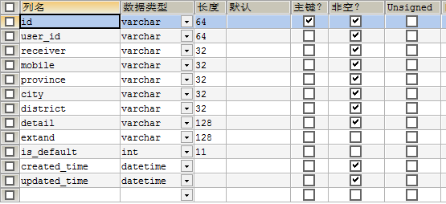

typora-root-url: 开文档img

## 1配置环境

### 1.1导入sql

使用foodile-sql.sql文件导入

所有id是varchar类型，为了以后做集群和分布式

category分类表：自关联

表结构框架

### 1.2导入依赖

```xml
<dependency>
            <groupId>org.springframework.boot</groupId>
            <artifactId>spring-boot-starter-web</artifactId>
        </dependency>
        <dependency>
            <groupId>org.mybatis.spring.boot</groupId>
            <artifactId>mybatis-spring-boot-starter</artifactId>
            <version>2.1.2</version>
        </dependency>

        <dependency>
            <groupId>org.springframework.boot</groupId>
            <artifactId>spring-boot-configuration-processor</artifactId>
            <optional>true</optional>
        </dependency>
        <dependency>
            <groupId>org.projectlombok</groupId>
            <artifactId>lombok</artifactId>
            <optional>true</optional>
        </dependency>
        <dependency>
            <groupId>org.springframework.boot</groupId>
            <artifactId>spring-boot-starter-test</artifactId>
            <scope>test</scope>
            <exclusions>
                <exclusion>
                    <groupId>org.junit.vintage</groupId>
                    <artifactId>junit-vintage-engine</artifactId>
                </exclusion>
            </exclusions>
        </dependency>
        <!--  mybatis-springboot整合的依赖  -->
        <dependency>
            <groupId>org.mybatis.spring.boot</groupId>
            <artifactId>mybatis-spring-boot-starter</artifactId>
            <version>2.1.2</version>
        </dependency>
        <!-- 数据库驱动 -->
        <dependency>
            <groupId>mysql</groupId>
            <artifactId>mysql-connector-java</artifactId>
        </dependency>


        <dependency>
            <groupId>org.projectlombok</groupId>
            <artifactId>lombok</artifactId>
            <optional>true</optional>
        </dependency>
        <!--mybatis分页插件-->
        <dependency>
            <groupId>com.github.pagehelper</groupId>
            <artifactId>pagehelper-spring-boot-starter</artifactId>
            <version>1.2.13</version>
        </dependency>

        <!--tk相关mapper-->
        <dependency>
            <groupId>tk.mybatis</groupId>
            <artifactId>mapper-spring-boot-starter</artifactId>
            <version>1.2.4</version>
        </dependency>
        <!-- mybatis 逆向生成工具  -->
        <dependency>
            <groupId>org.mybatis.generator</groupId>
            <artifactId>mybatis-generator-core</artifactId>
            <version>1.3.2</version>
            <scope>compile</scope>
            <optional>true</optional>
        </dependency>
```

### 1.3配置application.properties

```properties
#datasource
spring.datasource.driver-class-name=com.mysql.jdbc.Driver
spring.datasource.url=jdbc:mysql://localhost:3306/foodie?serverTimezone=GMT%2B8&characterEncoding=UTF-8
spring.datasource.username=root
spring.datasource.password=root
#mybatis
mybatis.configuration.map-underscore-to-camel-case=true
# 日志
logging.level.com.seven:debug
# 端口
server.port=8088
```

yaml

```yaml
# 日志
logging:
  level:
    com:
      seven: debug
# mybatis
mybatis:
  configuration:
    map-underscore-to-camel-case: true
# 数据源
spring:
  datasource:
    driver-class-name: com.mysql.jdbc.Driver
    hikari:                           # 数据源
      connection-timeout: 30000       # 等待连接池分配连接的最大时长（毫秒），超过这个时长还没可用的连接则发生SQLException， 默认:30秒
      minimum-idle: 5                 # 最小连接数
      maximum-pool-size: 20           # 最大连接数
      auto-commit: true               # 自动提交
      idle-timeout: 600000            # 连接超时的最大时长（毫秒），超时则被释放（retired），默认:10分钟
      pool-name: DateSourceHikariCP     # 连接池名字
      max-lifetime: 1800000           # 连接的生命时长（毫秒），超时而且没被使用则被释放（retired），默认:30分钟 1800000ms
      connection-test-query: SELECT 1
    password: root
    url: jdbc:mysql://localhost:3306/foodie?serverTimezone=GMT%2B8&characterEncoding=UTF-8
    username: root
# 修改端口
server:
  port: 8088
```

### 1.4配置MyMapper


```java
public interface MyMapper<T> extends Mapper<T>, MySqlMapper<T> {
}
```

### 1.5配置

generatorConfig.xml

### 1.6使用反向生成工具生成

创建GeneratorDisplay

```java
public class GeneratorDisplay {

	public void generator() throws Exception {

		List<String> warnings = new ArrayList<String>();
		boolean overwrite = true;
		//指定 逆向工程配置文件
		File configFile = new File("generatorConfig.xml");
		ConfigurationParser cp = new ConfigurationParser(warnings);
		Configuration config = cp.parseConfiguration(configFile);
		DefaultShellCallback callback = new DefaultShellCallback(overwrite);
		MyBatisGenerator myBatisGenerator = new MyBatisGenerator(config,
				callback, warnings);
		myBatisGenerator.generate(null);

	} 
	public static void main(String[] args) throws Exception {
		try {
			GeneratorDisplay generatorSqlmap = new GeneratorDisplay();
			generatorSqlmap.generator();
		} catch (Exception e) {
			e.printStackTrace();
		}
		
	}
}
```

### 1.7注意事项


```java
import tk.mybatis.spring.annotation.MapperScan;
@MapperScan(basePackages = "com.seven.dao")
```

### 1.8运行测试

```java
    @Autowired
    private UsersMapper usersMapper;
    @Test
    void contextLoads() {
        System.out.println(usersMapper.selectAll());
    }
```


### 1.9其他配置

#### 1.9.1日志写出配置

1. 注销我们配置的日志

   ```yaml
   ## 日志
   #logging:
   #  level:
   #    com:
   #      seven: debug
   ```

2. 导入logback-spring.xml配置

3. 导入颜色工具类

   ```java
   /**
    * 日志输出颜色
    */
   public class LogbackColorful extends ForegroundCompositeConverterBase<ILoggingEvent> {
   
       @Override
       protected String getForegroundColorCode(ILoggingEvent event) {
           Level level = event.getLevel();
           switch (level.toInt()) {
               //ERROR等级为红色
               case Level.ERROR_INT:
                   return ANSIConstants.RED_FG;
               //WARN等级为黄色
               case Level.WARN_INT:
                   return ANSIConstants.YELLOW_FG;
               //INFO等级为蓝色
               case Level.INFO_INT:
                   return ANSIConstants.BLUE_FG;
               //DEBUG等级为绿色
               case Level.DEBUG_INT:
                   return ANSIConstants.GREEN_FG;
               //其他为默认颜色
               default:
                   return ANSIConstants.DEFAULT_FG;
           }
       }
   }
   ```

#### 1.9.2AOP监视执行效率

1. 导入AOP依赖

   ```xml
           <!--aop相关-->
           <dependency>
               <groupId>org.springframework.boot</groupId>
               <artifactId>spring-boot-starter-aop</artifactId>
               <version>2.2.5.RELEASE</version>
           </dependency>
   ```

2. 创建aspect.ServiceLogAspect切面编程类

   ```java
   /**
    * @ClassName ServiceLogAspect
    * @Description TODO
    * @Author seven
    * @Date 2020/4/8 15:35
    * @Version 1.0
    * 记录Service层的运行效率
    **/
   @Aspect
   @Component
   @Slf4j
   public class ServiceLogAspect {
   
       @Around("execution(* com.seven.service..impl..*.*(..))")
       private Object recordTimeLog(ProceedingJoinPoint joinPoint) throws Throwable {
           //获取当前执行的对象
           log.info("===== 开始执行 {}.{} =====",
                   joinPoint.getTarget().getClass(),
                   joinPoint.getSignature().getName());
           //获取到时间戳
           long start = System.currentTimeMillis();
           //执行目标方法
           Object proceed = joinPoint.proceed();
           //结束时间
           long end = System.currentTimeMillis();
           long runTime=end-start;
           //记录运行时间
           if (runTime>3000){
               log.error("===== 执行结束，耗时：{} 毫秒 =====",runTime);
           }else if(runTime>2000){
               log.warn("===== 执行结束，耗时：{} 毫秒 =====",runTime);
           }else {
               log.info("===== 执行结束，耗时：{} 毫秒 =====",runTime);
           }
           return proceed;
       }
   }
   ```

## 2配置相关工具类

### 2.1CookieUtils：cookie工具

```java
package com.seven.utils;

import org.slf4j.Logger;
import org.slf4j.LoggerFactory;

import javax.servlet.http.Cookie;
import javax.servlet.http.HttpServletRequest;
import javax.servlet.http.HttpServletResponse;
import java.io.UnsupportedEncodingException;
import java.net.URLDecoder;
import java.net.URLEncoder;


/**
 * @author imooc
 * @version V1.0
 * @Title: CookieUtils.java
 * @Package com.imooc.utils
 * @Description: Cookie 工具类
 * Copyright: Copyright (c)
 * Company: www.imooc.com
 */
public final class CookieUtils {

    final static Logger logger = LoggerFactory.getLogger(CookieUtils.class);

    /**
     * @param request
     * @param cookieName
     * @return
     * @Description: 得到Cookie的值, 不编码
     */
    public static String getCookieValue(HttpServletRequest request, String cookieName) {
        return getCookieValue(request, cookieName, false);
    }

    /**
     * @param request
     * @param cookieName
     * @param isDecoder
     * @return
     * @Description: 得到Cookie的值
     */
    public static String getCookieValue(HttpServletRequest request, String cookieName, boolean isDecoder) {
        Cookie[] cookieList = request.getCookies();
        if (cookieList == null || cookieName == null) {
            return null;
        }
        String retValue = null;
        try {
            for (int i = 0; i < cookieList.length; i++) {
                if (cookieList[i].getName().equals(cookieName)) {
                    if (isDecoder) {
                        retValue = URLDecoder.decode(cookieList[i].getValue(), "UTF-8");
                    } else {
                        retValue = cookieList[i].getValue();
                    }
                    break;
                }
            }
        } catch (UnsupportedEncodingException e) {
            e.printStackTrace();
        }
        return retValue;
    }

    /**
     * @param request
     * @param cookieName
     * @param encodeString
     * @return
     * @Description: 得到Cookie的值
     */
    public static String getCookieValue(HttpServletRequest request, String cookieName, String encodeString) {
        Cookie[] cookieList = request.getCookies();
        if (cookieList == null || cookieName == null) {
            return null;
        }
        String retValue = null;
        try {
            for (int i = 0; i < cookieList.length; i++) {
                if (cookieList[i].getName().equals(cookieName)) {
                    retValue = URLDecoder.decode(cookieList[i].getValue(), encodeString);
                    break;
                }
            }
        } catch (UnsupportedEncodingException e) {
            e.printStackTrace();
        }
        return retValue;
    }

    /**
     * @param request
     * @param response
     * @param cookieName
     * @param cookieValue
     * @Description: 设置Cookie的值 不设置生效时间默认浏览器关闭即失效,也不编码
     */
    public static void setCookie(HttpServletRequest request, HttpServletResponse response, String cookieName,
                                 String cookieValue) {
        setCookie(request, response, cookieName, cookieValue, -1);
    }

    /**
     * @param request
     * @param response
     * @param cookieName
     * @param cookieValue
     * @param cookieMaxage
     * @Description: 设置Cookie的值 在指定时间内生效,但不编码
     */
    public static void setCookie(HttpServletRequest request, HttpServletResponse response, String cookieName,
                                 String cookieValue, int cookieMaxage) {
        setCookie(request, response, cookieName, cookieValue, cookieMaxage, false);
    }

    /**
     * @param request
     * @param response
     * @param cookieName
     * @param cookieValue
     * @param isEncode
     * @Description: 设置Cookie的值 不设置生效时间,但编码
     * 在服务器被创建，返回给客户端，并且保存客户端
     * 如果设置了SETMAXAGE(int seconds)，会把cookie保存在客户端的硬盘中
     * 如果没有设置，会默认把cookie保存在浏览器的内存中
     * 一旦设置setPath()：只能通过设置的路径才能获取到当前的cookie信息
     */
    public static void setCookie(HttpServletRequest request, HttpServletResponse response, String cookieName,
                                 String cookieValue, boolean isEncode) {
        setCookie(request, response, cookieName, cookieValue, -1, isEncode);
    }

    /**
     * @param request
     * @param response
     * @param cookieName
     * @param cookieValue
     * @param cookieMaxage
     * @param isEncode
     * @Description: 设置Cookie的值 在指定时间内生效, 编码参数
     */
    public static void setCookie(HttpServletRequest request, HttpServletResponse response, String cookieName,
                                 String cookieValue, int cookieMaxage, boolean isEncode) {
        doSetCookie(request, response, cookieName, cookieValue, cookieMaxage, isEncode);
    }

    /**
     * @param request
     * @param response
     * @param cookieName
     * @param cookieValue
     * @param cookieMaxage
     * @param encodeString
     * @Description: 设置Cookie的值 在指定时间内生效, 编码参数(指定编码)
     */
    public static void setCookie(HttpServletRequest request, HttpServletResponse response, String cookieName,
                                 String cookieValue, int cookieMaxage, String encodeString) {
        doSetCookie(request, response, cookieName, cookieValue, cookieMaxage, encodeString);
    }

    /**
     * @param request
     * @param response
     * @param cookieName
     * @Description: 删除Cookie带cookie域名
     */
    public static void deleteCookie(HttpServletRequest request, HttpServletResponse response,
                                    String cookieName) {
        doSetCookie(request, response, cookieName, null, -1, false);
//        doSetCookie(request, response, cookieName, "", -1, false);
    }


    /**
     * @param request
     * @param response
     * @param cookieName
     * @param cookieValue
     * @param cookieMaxage cookie生效的最大秒数
     * @param isEncode
     * @Description: 设置Cookie的值，并使其在指定时间内生效
     */
    private static final void doSetCookie(HttpServletRequest request, HttpServletResponse response,
                                          String cookieName, String cookieValue, int cookieMaxage, boolean isEncode) {
        try {
            if (cookieValue == null) {
                cookieValue = "";
            } else if (isEncode) {
                cookieValue = URLEncoder.encode(cookieValue, "utf-8");
            }
            Cookie cookie = new Cookie(cookieName, cookieValue);
            if (cookieMaxage > 0)
                cookie.setMaxAge(cookieMaxage);
            if (null != request) {// 设置域名的cookie
                String domainName = getDomainName(request);
                logger.info("========== domainName: {} ==========", domainName);
                if (!"localhost".equals(domainName)) {
                    cookie.setDomain(domainName);
                }
            }
            cookie.setPath("/");
            response.addCookie(cookie);
        } catch (Exception e) {
            e.printStackTrace();
        }
    }

    /**
     * @param request
     * @param response
     * @param cookieName
     * @param cookieValue
     * @param cookieMaxage cookie生效的最大秒数
     * @param encodeString
     * @Description: 设置Cookie的值，并使其在指定时间内生效
     */
    private static final void doSetCookie(HttpServletRequest request, HttpServletResponse response,
                                          String cookieName, String cookieValue, int cookieMaxage, String encodeString) {
        try {
            if (cookieValue == null) {
                cookieValue = "";
            } else {
                cookieValue = URLEncoder.encode(cookieValue, encodeString);
            }
            Cookie cookie = new Cookie(cookieName, cookieValue);
            if (cookieMaxage > 0)
                cookie.setMaxAge(cookieMaxage);
            if (null != request) {// 设置域名的cookie
                String domainName = getDomainName(request);
                logger.info("========== domainName: {} ==========", domainName);
                if (!"localhost".equals(domainName)) {
                    cookie.setDomain(domainName);
                }
            }
            cookie.setPath("/");
            response.addCookie(cookie);
        } catch (Exception e) {
            e.printStackTrace();
        }
    }

    /**
     * @return
     * @Description: 得到cookie的域名
     */
    private static final String getDomainName(HttpServletRequest request) {
        String domainName = null;

        String serverName = request.getRequestURL().toString();
        if (serverName == null || serverName.equals("")) {
            domainName = "";
        } else {
            serverName = serverName.toLowerCase();
            serverName = serverName.substring(7);
            final int end = serverName.indexOf("/");
            serverName = serverName.substring(0, end);
            if (serverName.indexOf(":") > 0) {
                String[] ary = serverName.split("\\:");
                serverName = ary[0];
            }

            final String[] domains = serverName.split("\\.");
            int len = domains.length;
            if (len > 3 && !isIp(serverName)) {
                // www.xxx.com.cn
                domainName = "." + domains[len - 3] + "." + domains[len - 2] + "." + domains[len - 1];
            } else if (len <= 3 && len > 1) {
                // xxx.com or xxx.cn
                domainName = "." + domains[len - 2] + "." + domains[len - 1];
            } else {
                domainName = serverName;
            }
        }
        return domainName;
    }

    public static String trimSpaces(String IP) {//去掉IP字符串前后所有的空格
        while (IP.startsWith(" ")) {
            IP = IP.substring(1, IP.length()).trim();
        }
        while (IP.endsWith(" ")) {
            IP = IP.substring(0, IP.length() - 1).trim();
        }
        return IP;
    }

    public static boolean isIp(String IP) {//判断是否是一个IP
        boolean b = false;
        IP = trimSpaces(IP);
        if (IP.matches("\\d{1,3}\\.\\d{1,3}\\.\\d{1,3}\\.\\d{1,3}")) {
            String s[] = IP.split("\\.");
            if (Integer.parseInt(s[0]) < 255)
                if (Integer.parseInt(s[1]) < 255)
                    if (Integer.parseInt(s[2]) < 255)
                        if (Integer.parseInt(s[3]) < 255)
                            b = true;
        }
        return b;
    }

}
```

### 2.2JsonUtils：方便json转换工具

```java
package com.seven.utils;

import com.fasterxml.jackson.core.JsonProcessingException;
import com.fasterxml.jackson.databind.JavaType;
import com.fasterxml.jackson.databind.ObjectMapper;

import java.util.List;

/**
 * @author imooc
 * @Title: JsonUtils.java
 * @Package com.imooc.utils
 * @Description: json转换类
 * Copyright: Copyright (c)
 * Company: www.imooc.com
 */
public class JsonUtils {

    // 定义jackson对象
    private static final ObjectMapper MAPPER = new ObjectMapper();

    /**
     * 将对象转换成json字符串。
     *
     * @param data
     * @return
     */
    public static String objectToJson(Object data) {
        try {
            String string = MAPPER.writeValueAsString(data);
            return string;
        } catch (JsonProcessingException e) {
            e.printStackTrace();
        }
        return null;
    }

    /**
     * 将json结果集转化为对象
     *
     * @param jsonData json数据
     * @param beanType 对象中的object类型
     * @return
     */
    public static <T> T jsonToPojo(String jsonData, Class<T> beanType) {
        try {
            T t = MAPPER.readValue(jsonData, beanType);
            return t;
        } catch (Exception e) {
            e.printStackTrace();
        }
        return null;
    }

    /**
     * 将json数据转换成pojo对象list
     *
     * @param jsonData
     * @param beanType
     * @return
     */
    public static <T> List<T> jsonToList(String jsonData, Class<T> beanType) {
        JavaType javaType = MAPPER.getTypeFactory().constructParametricType(List.class, beanType);
        try {
            List<T> list = MAPPER.readValue(jsonData, javaType);
            return list;
        } catch (Exception e) {
            e.printStackTrace();
        }

        return null;
    }

}
```

### 2.3时间处理工具

```java
package com.seven.utils;


import java.text.ParseException;
import java.text.SimpleDateFormat;
import java.util.Date;

/**
 * @ClassName DateUtils
 * @Description TODO
 * @Author seven
 * @Date 9/3/2020 22:00
 * @Version 1.0
 **/
public class DateUtils {
    public static String data2String(Date date, String patt){
        SimpleDateFormat simpleDateFormat = new SimpleDateFormat(patt);
        return simpleDateFormat.format(date);
    }

    public static String data2String(java.sql.Date date,String patt){
        return data2String(new Date(date.getTime()),patt);
    }

    public static Date string2Date(String time,String patt){
        SimpleDateFormat simpleDateFormat = new SimpleDateFormat(patt);
        try {
            return simpleDateFormat.parse(time);
        } catch (ParseException e) {
            e.printStackTrace();
        }
        return null;
    }
    public static java.sql.Date string2DateSql(String time,String patt){
        SimpleDateFormat simpleDateFormat = new SimpleDateFormat(patt);
        try {
            return new java.sql.Date(simpleDateFormat.parse(time).getTime());
        } catch (ParseException e) {
            e.printStackTrace();
        }
        return null;
    }
}
```

### 2.4结果处理

```java
package com.foodie.demo.utils;


import com.foodie.demo.enums.IMOOCJSONEnum;

/**
 * @author 慕课网 - 风间影月
 * @version V1.0
 * @Title: IMOOCJSONResult.java
 * @Package com.imooc.utils
 * @Description: 自定义响应数据结构
 * 本类可提供给 H5/ios/安卓/公众号/小程序 使用
 * 前端接受此类数据（json object)后，可自行根据业务去实现相关功能
 * <p>
 * @Copyright: Copyright (c) 2020
 * @Company: www.imooc.com
 */
public class IMOOCJSONResult {


    // 响应业务状态
    private Integer status;

    // 响应消息
    private String msg;

    // 响应中的数据
    private Object data;


    public static IMOOCJSONResult build(Integer status, String msg, Object data) {
        return new IMOOCJSONResult(status, msg, data);
    }


    public static IMOOCJSONResult ok(Object data) {
        return new IMOOCJSONResult(data);
    }

    public static IMOOCJSONResult ok() {
        return new IMOOCJSONResult(null);
    }

    public static IMOOCJSONResult errorMsg(String msg) {
        return new IMOOCJSONResult(IMOOCJSONEnum.ERROR.getCode(), msg, null);
    }

    public static IMOOCJSONResult errorMap(Object data) {
        return new IMOOCJSONResult(IMOOCJSONEnum.ERROR_MAP.getCode(), "error", data);
    }

    public static IMOOCJSONResult errorTokenMsg(String msg) {
        return new IMOOCJSONResult(IMOOCJSONEnum.ERROR_FILTER.getCode(), msg, null);
    }

    public static IMOOCJSONResult errorException(String msg) {
        return new IMOOCJSONResult(IMOOCJSONEnum.ERROR_EXCEPTION.getCode(), msg, null);
    }

    public static IMOOCJSONResult errorUserQQ(String msg) {
        return new IMOOCJSONResult(IMOOCJSONEnum.ERROR_QQ.getCode(), msg, null);
    }

    public IMOOCJSONResult() {

    }

    public IMOOCJSONResult(Integer status, String msg, Object data) {
        this.status = status;
        this.msg = msg;
        this.data = data;
    }


    public IMOOCJSONResult(Object data) {
        this.status = IMOOCJSONEnum.SUCCESS.getCode();
        this.msg = "OK";
        this.data = data;
    }

    public Boolean isOK() {
        return this.status == IMOOCJSONEnum.SUCCESS.getCode();
    }

    public Integer getStatus() {
        return status;
    }

    public void setStatus(Integer status) {
        this.status = status;
    }

    public String getMsg() {
        return msg;
    }

    public void setMsg(String msg) {
        this.msg = msg;
    }

    public Object getData() {
        return data;
    }

    public void setData(Object data) {
        this.data = data;
    }


}

```

code枚举

```java
package com.seven.utils;


public enum IMOOCJSONEnum {
     success(200,"表示成功"),
    error(500,"表示错误，错误信息在msg字段中"),
    errorMap(501,"bean验证错误，不管多少个错误都以map形式返回"),
    errorFilter(502,"拦截器拦截到用户token出错"),
    errorException(555,"异常抛出信息"),
    errorQQ(556,"用户qq校验异常");
     private int code;
     private String point;
     IMOOCJSONEnum(int code,String point){
         this.code=code;
         this.point=point;
     }
}
```

## 3跨越配置并连接


```java
package com.seven.config;

import org.springframework.context.annotation.Bean;
import org.springframework.context.annotation.Configuration;
import org.springframework.web.cors.CorsConfiguration;
import org.springframework.web.cors.UrlBasedCorsConfigurationSource;
import org.springframework.web.filter.CorsFilter;
/**
 * 解决跨越问题
 */
@Configuration
public class CorsConfig {

    public CorsConfig() {
    }

    @Bean
    public CorsFilter corsFilter() {
        // 1. 添加cors配置信息
        CorsConfiguration config = new CorsConfiguration();
        //前台请求url
        config.addAllowedOrigin("http://localhost:8080");
        //config.addAllowedOrigin("*");
        // 设置是否发送cookie信息
        config.setAllowCredentials(true);

        // 设置允许请求的方式
        config.addAllowedMethod("*");
        // 设置允许的header
        config.addAllowedHeader("*");

        // 2. 为url添加映射路径
        UrlBasedCorsConfigurationSource corsSource = new UrlBasedCorsConfigurationSource();
        corsSource.registerCorsConfiguration("/**", config);

        // 3. 返回重新定义好的corsSource
        return new CorsFilter(corsSource);
    }

}
```

将前段项目放在tomcat里，以便交互


启动前端项目：[开发连接](http://localhost:8080/foodie-shop/)


## 4使用swagger2

swagger是一个自动生成接口文档的工具，以往都是手写接口文档，难免不了许多出错的地方，swagger的出现大大地减少了开发人员处理这些琐碎时间，能让开发员专注于系统本身工作。swagger能自动生成restful风格的接口文档，并且支持在线测试，也能够为其他接口文档工具提供数据。下面介绍swagger的两种使用方式。

详情到官网https://swagger.io/

简单来说：就是用于生成api文档给前端人员开发

### 4.1导入依赖

```xml
<!--swagger2前后端开发文档-->
        <dependency>
            <groupId>io.springfox</groupId>
            <artifactId>springfox-swagger-ui</artifactId>
            <version>2.9.2</version>
        </dependency>
        <dependency>
            <groupId>io.springfox</groupId>
            <artifactId>springfox-swagger2</artifactId>
            <version>2.9.2</version>
        </dependency>
```

### 4.2整合springboot

#### 4.2.1创建Swagger2Config配置类并添加注解

@Configuration

@EnablSwagger2 //启用Swagger

```java
@Configuration
@EnableSwagger2 //启用Swagger
public class Swagger2Config {

}
```

#### 4.2.2注入一个@Bean

```java
//扫描的controller全限定包名    
public static final String SWAGGER_SCAN_BASE_PACKAGE = "com.seven.web";

    public static final String VERSION = "1.0.0";
@Bean
    public Docket createRestApi() {
        return new Docket(DocumentationType.SWAGGER_2)
                .apiInfo(apiInfo())
                .select()
                .apis(RequestHandlerSelectors.basePackage(SWAGGER_SCAN_BASE_PACKAGE))
                .paths(PathSelectors.any()) // 可以根据url路径设置哪些请求加入文档，忽略哪些请求
                .build();
    }
```

#### 4.2.3创建方法

```java
    private ApiInfo apiInfo() {
        return new ApiInfoBuilder()
                .title("foodie-shop") //设置文档的标题
                .description("foodie-shop API 接口文档") // 设置文档的描述
                .version(VERSION) // 设置文档的版本信息-> 1.0.0 Version information
                .termsOfServiceUrl("http://locahost:8088") // 设置文档的License信息->1.3 License information
                .build();
    }
```

#### 4.2.4需要在你的controller里添加@Api注解。如下：

```java
@Api(value = "用户相关")
@RestController
@RequestMapping("/passport")
public class PassportController {
    
}
```

#### 4.2.5生成Swagger文档

启动项目可以看见生成文档了


[访问文档连接](http://localhost:8088/swagger-ui.html#/)


### 4.3Swagger详解

1. @Api：修饰整个类，描述Controller的作用

   - value：名称

   - tags：标签

     

2. @ApiOperation：描述一个类的一个方法，或者说一个接口

   - value：名称

3. @ApiParam：单个参数描述

4. @ApiModel：用对象来接收参数

5. @ApiProperty：用对象接收参数时，描述对象的一个字段

6. @ApiResponse:HTTP响应其中1个描述

7. @ApiResponses:HTTP响应整体描述
   Apilgnore：使用该注解忽略这个APl ApiError：发生错误返回的信息

8. @ApilmplicitParam：描述一个请求参数，可以配置参数的中文含义，还可以给参数设置默认

9. @ApilmplicitParams：描述由多个

   ```java
   @Controller
   @RequestMapping("/test")
   @Api(value = "Api值",tags = {"标签1","标签2"})
   public class SwaggerTestController {
       @ApiOperation(value = "ApiOperation值",tags = {"ApiOperation标签"})
       @GetMapping("/test")
       public void test(@ApiParam(name= "ApiParam名称",value = "ApiParam值",required = true) String parameter){
   
       }
       @ApiOperation(value = "ApiOperation值",tags = {"ApiOperation标签"})
       @GetMapping("/test2")
       public void test2(@ApiParam(name = "用户对象",value = "注册传入json格式",required = true)UsersBO usersBO){
   
       }
   }
   ```

   UserBO

   ```java
   @Getter
   @Setter
   @ApiModel(value = "userBo对象",description = "注册的用户信息")
   public class UsersBO {
       @ApiModelProperty(value = "账号",name = "username",example = "seven")
       private String username;
       @ApiModelProperty(value = "密码",name = "password",example = "123456")
       private String password;
       @ApiModelProperty(value = "确认密码",name = "confirmPassword",example = "123456")
       private String confirmPassword;
   }
   ```

   

   一般用

   @Api

   @ApiOperation

   @ApiModel

   更多了解[官网](https://swagger.io/)

***特别说明由于我是先有前端模板（及url）再开发后端模板，这里的swagger这是为了介绍后端开发文档怎么用工具生成***

## 5完成登录注册模块

### 5.1创建web.PassportController

根据前端url完成

#### 5.1.1完成usernameIsExist

【视图层】

```java
package com.seven.web;

import com.seven.entity.Users;
import com.seven.entityBO.UsersBO;
import com.seven.service.UsersService;
import com.seven.utils.IMOOCJSONResult;
import org.springframework.beans.factory.annotation.Autowired;
import org.springframework.util.StringUtils;
import org.springframework.web.bind.annotation.*;
import tk.mybatis.mapper.entity.Example;

@RestController
@RequestMapping("/passport")
public class PassportController{
    @Autowired
    private UsersService usersService;
    @GetMapping("/usernameIsExist")
    public IMOOCJSONResult usernameIsExist(String username){
        if (StringUtils.isEmpty(username)){
            return IMOOCJSONResult.errorMsg("账号不能为空~");
        }
        return usersService.getUsersByUsername(username)==null?IMOOCJSONResult.ok():IMOOCJSONResult.errorMsg("账号存在");
    }
}
```

【业务层】

接口

```java
public interface UsersService {
    /**
     * 通过username查询用户，用于判断用户是否注册
     * @param username：用户名
     * @return
     */
    Users getUsersByUsername(String username);
}
```

实现类

```java
@Service
public class UsersServiceImpl implements UsersService {
    @Autowired
    private UsersMapper usersMapper;
    @Override
    public Users getUsersByUsername(String username) {
        Example example = new Example(Users.class);
        Example.Criteria criteria = example.createCriteria();
        criteria.andEqualTo("username",username);
        return usersMapper.selectOneByExample(example);
    }
}
```

使用postman测试

使用前段测试


#### 5.1.2完成注册regist（todo密码加密）

字段非空主要


face：`http://122.152.205.72:88/group1/M00/00/05/CpoxxFw_8_qAIlFXAAAcIhVPdSg994.png`

【BO类】

```java
@Getter
@Setter
public class UsersBO {
    @NotBlank(message = "用户名不能为空哦")
    private String username;
    @NotBlank(message = "密码不能为空哦")
    @Length(min = 6,message = "密码最少6位")
    private String password;
    @Length(min = 6,message = "密码最少6位")
    // TODO: 2020/4/7  校验password和confirmPassword是否一样由于写不来（不晓得怎么把password的值给这个校验）
    private String confirmPassword;
}
```

【定义一个校验异常处理类】

```java
/**
 * 全局异常处理类
 */
@RestControllerAdvice
public class GlobalExceptionHandler {

    @ExceptionHandler(value = MethodArgumentNotValidException.class)
    public IMOOCJSONResult error(MethodArgumentNotValidException e) {
        List<FieldError> fieldErrors = e.getBindingResult().getFieldErrors();
        //多个错误，取第一个
        FieldError error = fieldErrors.get(0);
        String msg = error.getDefaultMessage();
        return IMOOCJSONResult.errorMsg(msg);
    }

    // 上传文件超过500k，捕获异常：MaxUploadSizeExceededException
    @ExceptionHandler(MaxUploadSizeExceededException.class)
    public IMOOCJSONResult handlerMaxUploadFile(MaxUploadSizeExceededException ex) {
        return IMOOCJSONResult.errorMsg("文件上传大小不能超过500k，请压缩图片或者降低图片质量再上传！");
    }

    @ExceptionHandler(value = Exception.class)
    @ResponseBody
    public IMOOCJSONResult error(Exception e) {
        return IMOOCJSONResult.errorMsg(e.getMessage());
    }

}
```

【视图层】

```java
    /**
     * 需要先验证是否该用户名存在（数据库设置字段UNIQUE:唯一 也能解决）
     *
     * @param usersBO
     * @return
     */
    @PostMapping("/regist")
    public IMOOCJSONResult regist(@Valid @RequestBody UsersBO usersBO, HttpServletRequest reques, HttpServletResponse response) {
        if (usersService.getUsersByUsername(usersBO.getUsername()) == null) {
            //注册成功,要把用户信息返回给客户端
            Users users = usersService.saveUsers(usersBO);
            //把用户以cookie返回
            CookieUtils.setCookie(reques,response,"user",JsonUtils.objectToJson(users),true);
            return IMOOCJSONResult.ok(users);
        } else {
            return IMOOCJSONResult.errorMsg("账号存在");
        }
    }
```

【常量】

```java
public class Constant {
   public static String  USER_FACE="http://122.152.205.72:88/group1/M00/00/05/CpoxxFw_8_qAIlFXAAAcIhVPdSg994.png";
}
```

【枚举】

```java
@Getter
public enum SexEnum {
    woman(0,"女"),
    man(1,"男"),
    secret(2,"保密");
    private Integer id;
    private String sex;
    SexEnum(Integer id,String sex){
        this.id=id;
        this.sex=sex;
    }
}
```

【业务层】

接口

```java
    /**
     * 保存注册的用户
     * @param usersBO：用户
     * @return users 用于返回cookies
     */
    Users saveUsers(UsersBO usersBO);
```

实现类（密码没有做处理）

```java
@Override
    @Transactional
    public Users saveUsers(UsersBO usersBO) {
        Users users = new Users();
        //生成唯一id
        users.setId(UUID.randomUUID().toString());
        users.setUsername(usersBO.getUsername());
        users.setPassword(usersBO.getPassword());
        users.setCreatedTime(new Date());
        users.setUpdatedTime(new Date());
        //设置默认头像
        users.setFace(Constant.USER_FACE);
        //设计默认姓名
        users.setSex(SexEnum.secret.getId());
        usersMapper.insert(users);
        return users;
    }
```

#### 5.1.3完成登录login

【视图层】

```java
    @PostMapping("/login")
    public IMOOCJSONResult login(@Valid @RequestBody UsersBO usersBO, HttpServletRequest reques, HttpServletResponse response) {
        Users login = usersService.login(usersBO);
        if (login == null) {
            return IMOOCJSONResult.errorMsg("密码或用户名错误~");
        } else {
            //把用户以cookie返回
            CookieUtils.setCookie(reques,response,"user",JsonUtils.objectToJson(login),true);
            return IMOOCJSONResult.ok(login);
        }
    }
```

【业务层】

接口

```java
    /**
     * 登录用户，由于我的UserBO的confirmPassword属性有不为空判断
     * 解决思路：
     *  1.去掉不为空判断，使用自定义注解
     *  2.将参数改为Users对象
     * @param usersBO
     * @return
     */
    Users login(UsersBO usersBO);
```

实习类

```java
@Override
    public Users login(UsersBO usersBO) {
        Users users = new Users();
        users.setUsername(usersBO.getUsername());
        users.setPassword(usersBO.getPassword());
            return usersMapper.selectOne(users);
    }
```

【注意这里的敏感数据password不能返回前台】

处理方式1

```java
users.setPassword(null)
```

处理方式2(在com.seven.entity.Users类中要屏蔽的属性加入@JsonIgnore注解)

```java
    /**
     * 密码 密码
     * @JsonIgnore：忽略返回的json
     */
    @JsonIgnore
    private String password;
```

处理效果：


#### 5.1.4完成退出登录/logout

【视图层】

```java
    @ApiOperation("退出")
    @PostMapping("/logout")
    public IMOOCJSONResult logout(@RequestParam(value = "userId",required = true) String userId, HttpServletRequest reques, HttpServletResponse response){
        Users usersByUserId = usersService.findUsersByUserId(userId);
        //清空cookie
        CookieUtils.deleteCookie(reques,response,"user");
        // TODO: 2020/4/10  用户退出，需要清空购物车
        // TODO: 2020/4/10  分布式回话中需要清除用户数据
        return IMOOCJSONResult.ok();
    }
```

### 5.2安全问题

#### 5.2.1密码加密问题

**方案1**：

1. 导入依赖

   ```xml
           <!--加密相关-->
           <dependency>
               <groupId>commons-codec</groupId>
               <artifactId>commons-codec</artifactId>
               <version>1.14</version>
           </dependency>
   ```

2. 创建MD5Util

   ```java
   package com.seven.utils;
   
   import org.apache.commons.codec.binary.Base64;
   
   import java.security.MessageDigest;
   
   public class MD5Utils {
   
   	/**
   	 *
   	 * @Title: MD5Utils.java
   	 * @Package com.imooc.utils
   	 * @Description: 对字符串进行md5加密
   	 */
   	public static String getMD5Str(String strValue) throws Exception {
   		MessageDigest md5 = MessageDigest.getInstance("MD5");
   		String newstr = Base64.encodeBase64String(md5.digest(strValue.getBytes()));
   		return newstr;
   	}
   }
   ```

3. 修改userService中的save方法

   ```java
           try {
               users.setPassword(MD5Utils.getMD5Str(usersBO.getPassword()));
           } catch (Exception e) {
               e.printStackTrace();
               throw new RuntimeException("MD5加密异常");
           }
   ```

4. 修改userService中的login方法

   ```java
           Users users = new Users();
           users.setUsername(usersBO.getUsername());
           try {
               users.setPassword(MD5Utils.getMD5Str(usersBO.getPassword()));
               return usersMapper.selectOne(users);
           } catch (Exception e) {
               e.printStackTrace();
               throw new RuntimeException("MD5加密异常");
           }
   ```

*** 方案2**：使用JBCrypt盐加密

1. 导入jar

   ```xml
   <!-- Bcrypt加密 -->
   <dependency>
       <groupId>de.svenkubiak</groupId>
       <artifactId>jBCrypt</artifactId>
       <version>0.5.1</version>
   </dependency>
   ```

2. 修改userService中的save方法

   ```java
    @Override
       @Transactional
       public Users saveUsers(UsersBO usersBO) {
           Users users = new Users();
           //生成唯一id
           users.setId(UUID.randomUUID().toString());
           users.setUsername(usersBO.getUsername());
           users.setPassword(BCrypt.hashpw(usersBO.getPassword(),BCrypt.gensalt()));
           users.setCreatedTime(new Date());
           users.setUpdatedTime(new Date());
           //设置默认头像
           users.setFace(Constant.USER_FACE);
           //设计默认姓名
           users.setSex(SexEnum.secret.getId());
           usersMapper.insert(users);
           return users;
       }
   ```

3. 修改userService中的login方法

   ```java
   @Override
       public Users login(UsersBO usersBO) {
           Users users = new Users();
           users.setUsername(usersBO.getUsername());
           Users selectOne = usersMapper.selectOne(users);
           //先判断查询的结果是否为空
           if (selectOne==null){return null;}
           return BCrypt.checkpw(usersBO.getPassword(), selectOne.getPassword())?selectOne:null;
           }
   ```

*** 方案3**：使用springframework—security

springboot整合spring security

1. 导入依赖

   ```xml
   <!--权限和安全相关-->
           <dependency>
               <groupId>org.springframework.security</groupId>
               <artifactId>spring-security-web</artifactId>
           </dependency>
           <dependency>
               <groupId>org.springframework.security</groupId>
               <artifactId>spring-security-config</artifactId>
           </dependency>
           <dependency>
               <groupId>org.springframework.security</groupId>
               <artifactId>spring-security-core</artifactId>
           </dependency>
           <dependency>
               <groupId>org.springframework.security</groupId>
               <artifactId>spring-security-taglibs</artifactId>
           </dependency>
   ```

2. 配置

### 5.3问题

1. ` Caused by: java.lang.IllegalArgumentException: Result Maps collection already contains value for com.seven.dao.UsersMapper.BaseResultMap`**翻译：**`由以下原因引起：java.lang.IllegalArgumentException：结果映射集合已经包含com.seven.dao.UsersMapper.BaseResultMap的值`

   分析：说我的结果映射集已经存在？？？【赶紧去target去看看】

   解决：打开maven--->执行clean	或者	手动删除.xml文件（**如果还不行。。请检查你idea里的xml文件是否报错（如多了BaseResultMap等）再运行，IDea有时候编译资源不完整，你可以自己复制过去**）

2. 1

## 6完成首页模块

### 6.1创建web.IndexController

url：/index

#### 6.1.1各个分类下的最新6个商

url：/sixNewItems

【dao】

xml

```xml
<resultMap id="SimpleItemVO" type="com.seven.vo.ItemVO">
    <id column="root_cat_id" property="rootCatId"/>
    <result column="root_cat_name" property="rootCatName"/>
    <result column="slogan" property="slogan"/>
    <result property="catImage" column="cat_image"/>
    <result property="bgColor" column="bg_color"/>
    <collection property="simpleItemList" ofType="com.seven.vo.ItemSimpleVO">
      <id property="itemId" column="item_id"/>
      <result property="itemName" column="item_name"/>
      <result property="itemUrl" column="item_url"/>
    </collection>
   </resultMap>
    <select id="findByRootCatId" resultMap="SimpleItemVO">
select c.id root_cat_id,c.name root_cat_name,c.slogan slogan,c.cat_image,c.bg_color
     ,i.id item_id,i.item_name,img.url item_url
from category c,items i,items_img img
where c.id=i.root_cat_id and c.id=#{rootCatId} and img.item_id=i.id
    </select>
```

dao

```java
List<ItemVO> findByRootCatId(int rootCatId);
```

【vo】分装返回数据

```java
@Getter
@Setter
@ToString
public class ItemSimpleVO {
    private String itemId;
    private String itemName;
    private String itemUrl;
}
```

```java
@Getter
@Setter
@ToString
public class ItemVO {
    private Integer rootCatId;
    private String rootCatName;
    private String slogan;
    private String catImage;
    private String bgColor;
    private List<ItemSimpleVO> simpleItemList;
}
```

【视图层】

```java
    @ApiOperation("商品的最新6个商品展示图")
    @GetMapping("/sixNewItems/{rootCatId}")
    public IMOOCJSONResult sixNewItems(@PathVariable int rootCatId) {
        PageInfo<ItemVO> itemVOPageInfo = new PageInfo<>(itemsService.findLatest(rootCatId, 6));
        List<ItemVO> list = itemVOPageInfo.getList();
        log.warn(list.toString());
        return IMOOCJSONResult.ok(list);
    }
```

【业务层】

接口

```java
    /**
     *
     * @param rootCatId:查询的root_cat_id
     * @param count:查询的个数
     * @return
     */
    public List<ItemVO> findLatest(int rootCatId, int count);
```

实现类

```java
    @Override
    public List<ItemVO> findLatest(int rootCatId, int count) {
        PageHelper.startPage(1,count);
        return itemsMapper.findByRootCatId(rootCatId);
    }
```

#### 6.1.2轮播图

url：/carousel

【枚举】

```java
/**
 * 是否显示
 */
@Getter
public enum  YesOrNo {
    YES(1,"yes"),
    NO(0,"no");
    public final Integer code;
    public final String values;
    YesOrNo(Integer code,String values){
        this.code=code;
        this.values=values;
    }
}
```

【视图层】

```java
    @ApiOperation("查询所有轮播图")
    @GetMapping("/carousel")
    public IMOOCJSONResult carousel(){
        List<Carousel> all = carouselService.getAll(YesOrNo.YES.getCode());
        return IMOOCJSONResult.ok(all);
    }
```

【业务层】

接口

```java
public interface CarouselService {
    /**
     * 查询所有可以显示的轮播图
     * @param isShow
     * @return
     */
    List<Carousel> getAll(Integer isShow);
}
```

实现类

```java
@Service
public class CarouselServiceImpl implements CarouselService {
    @Autowired
    private CarouselMapper carouselMapper;
    @Override
    public List<Carousel> getAll(Integer isShow) {
        Example example = new Example(Carousel.class);
        Example.Criteria criteria = example.createCriteria();
        criteria.andEqualTo("isShow",isShow);
        return carouselMapper.selectByExample(example);
    }
}
```

#### 6.1.3商品分类 - 大分类

url:/cats

【视图层】

```java
    @ApiOperation("大分类侧导航")
    @GetMapping("/cats")
    public IMOOCJSONResult cats() {
        List<Category> byFatherId = categoryService.findByFatherId(0);
        return IMOOCJSONResult.ok(byFatherId);
    }
```

【业务层】

接口

```java
    /**
     * 更具father_id查询
     */
    List<Category> findByFatherId(int fatherId);
```

实现类

```java
    @Override
    public List<Category> findByFatherId(int fatherId) {
        Example example = new Example(Category.class);
        Example.Criteria criteria = example.createCriteria();
        criteria.andEqualTo("fatherId",fatherId);
        return categoryMapper.selectByExample(example);
    }
```

#### 6.1.4根据root分类id查询该分类下的所有子分类

url:/subCat

思路1，使用方法进行封装：

【其他类】

子类

```java
/**
 * 商品子类封装类
 */
@Getter
@Setter
@ToString
public class SubCategoryVO {
    private Integer subId;
    private String subName;
    private Integer subType;
    private Integer subFatherId;
    public SubCategoryVO(){}
    public SubCategoryVO(Category category){
        this.subId=category.getId();
        this.subName=category.getName();
        this.subType=category.getType();
        this.subFatherId=category.getFatherId();
    }
}
```

父类

```java
/**
 * 主要返回类（父类）
 **/
@Getter
@Setter
@ToString
public class CategoryVO {
    private Integer id;
    private String name;
    private Integer type;
    private Integer fatherId;
    private List<SubCategoryVO> subCatList;
    public CategoryVO(){}
    public CategoryVO(Category category){
        this.id=category.getId();
        this.name=category.getName();
        this.type=category.getType();
        this.fatherId=category.getFatherId();
    }
}
```

【视图层】

```java
    /**
     * 思路1：通过rootCatId找到二级分类，分装到一个list，再通过二级分类id找到他的子分类
     * 使用代码封装太发放
     * 思路2：通过自定义sql来
     * @param rootCatId
     * @return
     */
    @ApiOperation("细节分类")
    @GetMapping("/subCat/{rootCatId}")
    public IMOOCJSONResult subCat(@PathVariable int rootCatId){
        List<CategoryVO> sonByFatherId = categoryService.findSonByFatherId(rootCatId);
        return IMOOCJSONResult.ok(sonByFatherId);
    }
```

【业务层】

接口

```java
List<CategoryVO> findSonByFatherId(int fatherId);
```

实现类

```java
@Override
    public List<CategoryVO> findSonByFatherId(int fatherId) {
        ArrayList<CategoryVO> categoryBOS = new ArrayList<>();
        List<Category> byFatherId = findByFatherId(fatherId);
        for (Category category : byFatherId) {
            CategoryVO categoryBO = new CategoryVO(category);
            List<Category> son = findByFatherId(category.getId());
            List<SubCategoryVO> subCategoryBOS = new ArrayList<>();
            for (Category category1 : son) {
                subCategoryBOS.add(new SubCategoryVO(category1));
            }
            categoryBO.setSubCatList(subCategoryBOS);
            categoryBOS.add(categoryBO);
        }
        return categoryBOS;
    }
```

思路2：通过框架给你封装

【dao持久层】

dao接口

```java
    List<Category> findByFatherId(int fatherId);
    List<Category> findSonByFatherId(int fatherId);
```

xml

```xml
 <resultMap id="SubResultMap" type="com.seven.entity.Category">
    <id column="id" property="id" jdbcType="INTEGER" />
    <result column="name" property="name" jdbcType="VARCHAR" />
    <result column="type" property="type" jdbcType="INTEGER" />
    <result column="father_id" property="fatherId" jdbcType="INTEGER" />
    <collection property="subCatList" ofType="com.seven.vo.SubCategoryVO">
      <id column="subId" property="subId"/>
      <result column="subName" property="subName" jdbcType="VARCHAR" />
      <result column="subType" property="subType" jdbcType="INTEGER" />
      <result column="subFatherId" property="subFatherId" jdbcType="VARCHAR" />
    </collection>
  </resultMap>

  <select id="findSonByFatherId" resultMap="SubResultMap">
    select c.id, c.name,c.type,c.father_id,sub.*  from category c,
(
    select id subId,name subName,type subType,father_id subFatherId from category
where father_id in (select id from category where father_id=#{fatherId})
    ) sub
where c.id=sub.subFatherId;
  </select>
```

【视图层】

```java
    @ApiOperation("细节分类")
    @GetMapping("/subCat/{rootCatId}")
    public IMOOCJSONResult subCat(@PathVariable int rootCatId){
        List<Category> sonByFatherId = categoryService.findSonByFatherId02(rootCatId);
        return IMOOCJSONResult.ok(sonByFatherId);
    }
```

【业务层】

接口

```java
    /**
     * 通过mybatis封装来进行封装
     * @param fatherId
     * @return
     */
    List<Category> findSonByFatherId02(int fatherId);
```

实习类

```java
    @Override
    public List<Category> findSonByFatherId02(int fatherId) {
        return categoryMapper.findSonByFatherId(fatherId);
    }
```

【效果】


### 6.2问题

1. 在使用分页插件，返回的数据格式一致，但是并不能正确解析（貌似前段不能有分页插件似的）

   可能是我对pageHelper使用了解不知道吧

   解决：

   - 使用自定义排序，分页
   - 版本号换5.1.3及以上[原因](https://github.com/pagehelper/Mybatis-PageHelper/issues/204)

2. 

## 7完成item商品详情界面

### 7.1创建web.Itemcontroller

url：/items

#### 7.1.1完成商品详细信息

【视图层】

```java
@Api(value = "item", tags = "商品详情相关api")
@RestController
@RequestMapping("/items")
public class ItemsController {
    @Autowired
    private ItemsService itemsService;

    @ApiOperation("商品详情")
    @GetMapping("/info/{itemId}")
    public IMOOCJSONResult info(@PathVariable("itemId") String itemId){
        return IMOOCJSONResult.ok(itemsService.findById(itemId));
    }
}
```

【业务层】

接口

```java
HashMap<String, Object> findById(String itemsId);
```

实现类

```java
@Override
    public HashMap<String, Object> findById(String itemsId) {
        HashMap<String, Object> stringObjectHashMap = new HashMap<>();
        Example example = new Example(ItemsImg.class);
        Example.Criteria criteria = example.createCriteria();
        criteria.andEqualTo("itemId", itemsId);
        List<ItemsImg> itemsImgs = itemsImgMapper.selectByExample(example);
        stringObjectHashMap.put("itemImgList", itemsImgs);

        Example example1 = new Example(ItemsSpec.class);
        Example.Criteria example1Criteria = example1.createCriteria();
        example1Criteria.andEqualTo("itemId", itemsId);
        List<ItemsSpec> itemsSpecs = itemsSpecMapper.selectByExample(example1);
        stringObjectHashMap.put("itemSpecList", itemsSpecs);

        Example example2 = new Example(ItemsParam.class);
        Example.Criteria example2Criteria = example2.createCriteria();
        example2Criteria.andEqualTo("itemId", itemsId);
        List<ItemsParam> itemsParams = itemsParamMapper.selectByExample(example2);
        stringObjectHashMap.put("itemParams", itemsParams.get(0));

        Items items = itemsMapper.selectByPrimaryKey(itemsId);
        stringObjectHashMap.put("item",items);
        return stringObjectHashMap;
    }
```

#### 7.1.2商品评价等级数量

【枚举】

```java
/**
 * 评论等级
 */
@Getter
public enum CommentLevel {
    GOOD(1,"好评"),NORMAL(2,"一般"),BAD(3,"差评");
    Integer code;
    String info;
    CommentLevel(Integer code,String info){
        this.code=code;
        this.info=info;
    }
}
```

【视图层】

```java
    @ApiOperation("评论等级")
    @GetMapping("/commentLevel")
    public IMOOCJSONResult commentLevel(String itemId){
        return IMOOCJSONResult.ok(itemsService.findCommentByItemId(itemId));
    }
```

【业务层】

接口

```java
    /**
     * 通过id查找评论等级
     */
    HashMap<String,Object> findCommentByItemId(String itemsId);
```

实现类

```java
@Override
    public HashMap<String, Object> findCommentByItemId(String itemsId) {
        HashMap<String, Object> stringObjectHashMap = new HashMap<>();
        //查询好评
        Example example = new Example(ItemsComments.class);
        Example.Criteria criteria = example.createCriteria();
        criteria.andEqualTo("itemId",itemsId).andEqualTo("commentLevel", CommentLevel.GOOD.getCode());
        int good = itemsCommentsMapper.selectCountByExample(example);
        stringObjectHashMap.put("goodCounts",good);
        //一般评价
        Example example1 = new Example(ItemsComments.class);
        Example.Criteria criteria1 = example1.createCriteria();
        criteria1.andEqualTo("itemId",itemsId).andEqualTo("commentLevel", CommentLevel.NORMAL.getCode());
        int normal = itemsCommentsMapper.selectCountByExample(example1);
        stringObjectHashMap.put("normalCounts",normal);
        //坏评价
        Example example2 = new Example(ItemsComments.class);
        Example.Criteria criteria2 = example2.createCriteria();
        criteria2.andEqualTo("itemId",itemsId).andEqualTo("commentLevel", CommentLevel.BAD.getCode());
        int bad = itemsCommentsMapper.selectCountByExample(example2);
        stringObjectHashMap.put("badCounts",bad);
        //总评价
        stringObjectHashMap.put("totalCounts",(good+normal+bad));
        return stringObjectHashMap;
    }
```

#### 7.1.3评论分页

【工具类】

```json
package com.hzdl.foodie.utils;


/**
 * 通用脱敏工具类
 * 可用于：
 *      用户名
 *      手机号
 *      邮箱
 *      地址等
 */
public class DesensitizationUtil {

    private static final int SIZE = 6;
    private static final String SYMBOL = "*";

    public static void main(String[] args) {
        String name = commonDisplay("我爱编程");
        String mobile = commonDisplay("13900000000");
        String mail = commonDisplay("admin@imooc.com");
        String address = commonDisplay("成都市xxx街999号");

        System.out.println(name);
        System.out.println(mobile);
        System.out.println(mail);
        System.out.println(address);
    }

    /**
     * 通用脱敏方法
     * @param value
     * @return
     */
    public static String commonDisplay(String value) {
        if (null == value || "".equals(value)) {
            return value;
        }
        int len = value.length();
        int pamaone = len / 2;
        int pamatwo = pamaone - 1;
        int pamathree = len % 2;
        StringBuilder stringBuilder = new StringBuilder();
        if (len <= 2) {
            if (pamathree == 1) {
                return SYMBOL;
            }
            stringBuilder.append(SYMBOL);
            stringBuilder.append(value.charAt(len - 1));
        } else {
            if (pamatwo <= 0) {
                stringBuilder.append(value.substring(0, 1));
                stringBuilder.append(SYMBOL);
                stringBuilder.append(value.substring(len - 1, len));

            } else if (pamatwo >= SIZE / 2 && SIZE + 1 != len) {
                int pamafive = (len - SIZE) / 2;
                stringBuilder.append(value.substring(0, pamafive));
                for (int i = 0; i < SIZE; i++) {
                    stringBuilder.append(SYMBOL);
                }
                if ((pamathree == 0 && SIZE / 2 == 0) || (pamathree != 0 && SIZE % 2 != 0)) {
                    stringBuilder.append(value.substring(len - pamafive, len));
                } else {
                    stringBuilder.append(value.substring(len - (pamafive + 1), len));
                }
            } else {
                int pamafour = len - 2;
                stringBuilder.append(value.substring(0, 1));
                for (int i = 0; i < pamafour; i++) {
                    stringBuilder.append(SYMBOL);
                }
                stringBuilder.append(value.substring(len - 1, len));
            }
        }
        return stringBuilder.toString();
    }

}
```

【视图层】

```java
    @ApiOperation("/评论分页")
    @GetMapping("/comments")
    public IMOOCJSONResult comments(String itemId,String level,int page,int pageSize){
        HashMap<String, Object> stringObjectHashMap = itemsService.commentDetails(itemId, level, page, pageSize);
        return IMOOCJSONResult.ok(stringObjectHashMap);
    }
```

【业务层】

接口

```java
    /**
     * 分页详情，分页
     */
    HashMap<String,Object> commentDetails(String itemId,String level,int page,int pageSize);
```

实现类

```java
@Override
    public HashMap<String, Object> commentDetails(String itemId, String level, int page, int pageSize) {
        HashMap<String, Object> stringObjectHashMap = new HashMap<>();
        Example example = new Example(ItemsComments.class);
        Example.Criteria criteria = example.createCriteria();
        criteria.andEqualTo("itemId",itemId);
        //判断是否有level
        if (!StringUtils.isEmpty(level)){
            criteria.andEqualTo("commentLevel", level);
        }
        //分页插件
        PageHelper.startPage(page,pageSize);
        List<ItemsComments> itemsComments = itemsCommentsMapper.selectByExample(example);
        //获取分页对象
        PageInfo<ItemsComments> pageInfo = new PageInfo<>(itemsComments);
        //开始封装
        stringObjectHashMap.put("page",pageInfo.getPageNum());
        stringObjectHashMap.put("total",pageInfo.getPages());
        stringObjectHashMap.put("records",pageInfo.getTotal());
        //遍历，封装rows
        ArrayList<Map<String, Object>> mapArrayList = new ArrayList<>();
        for (ItemsComments itemsComment : pageInfo.getList()) {
            HashMap<String, Object> rows = new HashMap<>();
            rows.put("commentLevel",itemsComment.getCommentLevel());
            rows.put("sepcName",itemsComment.getSepcName());
            rows.put("content",itemsComment.getContent());
            rows.put("createdTime",itemsComment.getCreatedTime());
            Users users = usersMapper.selectByPrimaryKey(itemsComment.getUserId());
            rows.put("userFace",users.getFace());
           rows.put("nickname", DesensitizationUtil.commonDisplay(users.getNickname()));
        stringObjectHashMap.put("rows",mapArrayList);
        return stringObjectHashMap;
    }
```

#### 7.1.4搜索

【枚举】（可有可无）

```java
@Getter
public enum SortRule {
    DEFAULT("k","默认"),SALES("c","销量"),PRICE("p","价格");
    private String code;
    private String info;
    SortRule(String code,String info){
        this.code=code;
        this.info=info;
    }
}
```

【视图层】

```java
    @ApiOperation("搜索")
    @GetMapping("/search")
    public IMOOCJSONResult search(String keywords,String sort,int page,int pageSize){
        return IMOOCJSONResult.ok(itemsService.search(keywords, sort, page, pageSize));
    }
```

【业务层】

接口

```java
    /**
     * 关键词搜索
     */
    HashMap<String,Object> search(String keywords,String sort,int page,int pageSize);
```

实现类【为什么代码这么臃肿】

```java
@Override
    public HashMap<String, Object> search(String keywords, String sort, int page, int pageSize) {
        HashMap<String, Object> stringObjectHashMap = new HashMap<>();
        Example example = new Example(Items.class);
        Example.Criteria criteria = example.createCriteria();
        criteria.andLike("itemName","%"+keywords+"%");
        PageHelper.startPage(page,pageSize);
        List<Items> items = itemsMapper.selectByExample(example);
        //获取分页对象
        PageInfo<Items> pageInfo = new PageInfo<>(items);
        //开始封装
        stringObjectHashMap.put("page",pageInfo.getPageNum());
        stringObjectHashMap.put("total",pageInfo.getPages());
        stringObjectHashMap.put("records",pageInfo.getTotal());
        //遍历，封装rows
        ArrayList<Map<String, Object>> mapArrayList = new ArrayList<>();
        for (Items item : pageInfo.getList()) {
            HashMap<String, Object> rows = new HashMap<>();
            rows.put("itemId",item.getId());
            rows.put("itemName",item.getItemName());
            rows.put("sellCounts",item.getSellCounts());
            Example example2 = new Example(ItemsImg.class);
            Example.Criteria criteria2 = example2.createCriteria();
            criteria2.andEqualTo("itemId", item.getId());
            List<ItemsImg> itemsImgs = itemsImgMapper.selectByExample(example2);
            rows.put("imgUrl",itemsImgs.size()==0?null:itemsImgs.get(0).getUrl());
            //这里价格要最低的，这个排序。。。太丑了，简直了
            Example example3 = new Example(ItemsSpec.class);
            Example.Criteria criteria3 = example3.createCriteria();
            criteria3.andEqualTo("itemId", item.getId());
            List<ItemsSpec> itemsSpecs = itemsSpecMapper.selectByExample(example3);
            //排序，前-后 小到大。后-前 大到小(后大--->厚大)
            itemsSpecs.sort((Comparator) (o1, o2) -> {
                ItemsSpec itemsSpec1=(ItemsSpec) o1;
                ItemsSpec itemsSpec2=(ItemsSpec) o2;
                return itemsSpec1.getPriceDiscount()-itemsSpec2.getPriceDiscount();
            });
            rows.put("price",itemsSpecs.size()==0?null:itemsSpecs.get(0).getPriceDiscount());
            mapArrayList.add(rows);
            rows=null;
        }
        //sort排序
        if(SortRule.SALES.getCode().equals(sort)){
            //销量厚大
            mapArrayList.sort((Comparator) (o1, o2) -> {
                HashMap itemsSpec1=(HashMap) o1;
                HashMap itemsSpec2=(HashMap) o2;
                return (int)itemsSpec2.get("sellCounts")-(int)itemsSpec1.get("sellCounts");
            });
        }else {
            //价格前小
            mapArrayList.sort((Comparator) (o1, o2) -> {
                HashMap itemsSpec1=(HashMap) o1;
                HashMap itemsSpec2=(HashMap) o2;
                return (int)itemsSpec1.get("price")-(int)itemsSpec2.get("price");
            });
        }
        stringObjectHashMap.put("rows",mapArrayList);
        return stringObjectHashMap;
    }
```

#### 7.1.5侧导航栏物品类

【视图层】

```java
    @ApiOperation("侧导航栏物品类")
    @GetMapping("/catItems")
    public IMOOCJSONResult catItems(int catId,String sort, int page,int pageSize){
        return IMOOCJSONResult.ok(itemsService.findByCatId(catId, sort, page, pageSize));
    }
```

【业务层】

接口

```java
    /**
     * 通过CatId查找Items
     */
    HashMap<String, Object> findByCatId(int catId,String sort, int page,int pageSize);
```

实现类

```java
@Override
    public HashMap<String, Object> findByCatId(int catId,String sort, int page,int pageSize) {
        HashMap<String, Object> stringObjectHashMap = new HashMap<>();

        List<HashMap<String, Object>> hashMaps = new ArrayList<>();
        Example example = new Example(Items.class);
        Example.Criteria criteria = example.createCriteria();
        criteria.andEqualTo("catId",catId);
        PageHelper.startPage(page,pageSize);
        List<Items> items = itemsMapper.selectByExample(example);
        PageInfo<Items> pageInfo = new PageInfo<Items>(items);
        //开始封装
        stringObjectHashMap.put("page",pageInfo.getPageNum());
        stringObjectHashMap.put("total",pageInfo.getPages());
        stringObjectHashMap.put("records",pageInfo.getTotal());
        for (Items item : pageInfo.getList()) {
            HashMap<String, Object> rows = new HashMap<>();
            HashMap<String, Object> byId = findById(item.getId());
            ArrayList<ItemsImg> itemImgList = (ArrayList<ItemsImg>) byId.get("itemImgList");
            ArrayList<ItemsSpec> itemSpecList = (ArrayList<ItemsSpec>) byId.get("itemSpecList");
            rows.put("itemId",item.getId());
            rows.put("itemName",item.getItemName());
            rows.put("sellCounts",item.getSellCounts());
            rows.put("imgUrl",itemImgList.size()==0?null:itemImgList.get(0).getUrl());
            rows.put("price",getMinPrice(itemSpecList));
            hashMaps.add(rows);
            rows=null;
            byId=null;
        }
        mySort(sort, hashMaps);
        stringObjectHashMap.put("rows",hashMaps);
        return stringObjectHashMap;
    }
```

#### 7.1.6刷新用户购物车商品

【视图层】

```java
    @ApiOperation("刷新购买的商品信息")
    @GetMapping("/refresh")
    public IMOOCJSONResult refresh(@ApiParam(name = "itemSpecIds",value="传入itemSpecIds",required = true,example = "itemSpecIds=1,3,4") String itemSpecIds){
        ArrayList<Map> maps = new ArrayList<>();
        String[] split = itemSpecIds.split(",");
        for (String s : split) {
            maps.add(itemsService.findByItemSpecId(s));
        }
        return IMOOCJSONResult.ok(maps);
    }
```

【业务层】

接口

```java
    /**
     * 通过specId查询商品
     */
    HashMap<String,Object> findByItemSpecId(String itemSpecId);
```

实现类

```java
@Override
    public HashMap<String, Object> findByItemSpecId(String itemSpecId) {
        HashMap<String, Object> stringObjectHashMap = new HashMap<>();

        ItemsSpec itemsSpec = itemsSpecMapper.selectByPrimaryKey(itemSpecId);
        stringObjectHashMap.put("specId",itemsSpec.getId());
        stringObjectHashMap.put("specName",itemsSpec.getName());
        stringObjectHashMap.put("priceDiscount",itemsSpec.getPriceDiscount());
        stringObjectHashMap.put("priceNormal",itemsSpec.getPriceNormal());

        HashMap<String, Object> items = findById(itemsSpec.getItemId());
        Items item = (Items) items.get("item");
        stringObjectHashMap.put("itemId",item.getId());
        ArrayList<ItemsImg> itemImgList = (ArrayList<ItemsImg>) items.get("itemImgList");
        stringObjectHashMap.put("itemImgUrl",itemImgList.get(0).getUrl());
        stringObjectHashMap.put("itemName",item.getItemName());

        return stringObjectHashMap;
    }
```

或者

【视图层】

```java

```

【业务层】

接口

```java
    List<CartItems> findByItemSpecId2(String itemSpecId);
```

实现类

```java
    @Override
    public List<CartItems> findByItemSpecId2(String itemSpecId) {
        itemSpecId="\""+itemSpecId.replace(",", "\",\"")+"\"";
        return itemsMapper.findBySpecId(itemSpecId);
    }
```

【dao】

```java
@Repository
public interface ItemsMapper extends MyMapper<Items> {
    List<CartItems> findBySpecId(String specIds);
}
```

xml

```xml
<select id="findBySpecId" resultType="com.seven.vo.CartItems">
    select
      i.id itemId,
      i.item_name itemName,
      ii.url itemImgUrl,
      ip.id specId,
      ip.name sepcName,
      ip.price_discount priceDiscount,
      ip.price_normal priceNormal
      from items i,items_img ii,items_spec ip
    where ip.id in (${specIds}) and ip.item_id=i.id and ip.item_id=ii.item_id and ii.is_main =1;
    </select>
```

查询出来的对象

```java
@Data
public class CartItems {
    private String itemId;
    private String itemImgUrl;
    private String itemName;
    private String specId;
    private String specName;
    private Long priceDiscount;
    private Long priceNormal;
}
```

当然也可以使用foreach

```xml
 <select id="findByRootCatId" resultMap="SimpleItemVO">
select c.id root_cat_id,c.name root_cat_name,c.slogan slogan,c.cat_image,c.bg_color
     ,i.id item_id,i.item_name,img.url item_url
from category c,items i,items_img img
where c.id=i.root_cat_id and c.id=#{rootCatId} and img.item_id=i.id
    </select>
    <select id="findBySpecId" resultType="com.seven.vo.CartItems">
    select
      i.id itemId,
      i.item_name itemName,
      ii.url itemImgUrl,
      ip.id specId,
      ip.name sepcName,
      ip.price_discount priceDiscount,
      ip.price_normal priceNormal
      from items i,items_img ii,items_spec ip
    where ip.id in
     <foreach collection="array" separator="," open="(" close=")" item="specId">
         #{specId}
     </foreach>
     and ip.item_id=i.id and ip.item_id=ii.item_id and ii.is_main =1;
    </select>
```

当然Service也要做修改

### 7.2问题

1. 在我们做项目的时候，是尽可能写sql，少调用数据库执行sql呢？还是直接调用sql，次数可能多，但是sql语句简单，没有sql执行出来，在自己封装？
2. 

## 8购物车相关

url:/shopcart 

### 8.1创建web.ShopCartController

#### 8.1.1加入购物车

【视图层】

```java
@Controller
@Api("购物车相关")
@RequestMapping("/shopcart")
public class ShopCartController {

    @PostMapping("/add")
    public IMOOCJSONResult add(String userId,@RequestBody ShopCartItem shopcartItem){
        // TODO: 2020/4/10  将数据放在Redis中
        return IMOOCJSONResult.ok();
    }
}
```

【业务层】

接口

```java

```

实现类

```java

```

## 9地址

url:/address

### 9.1添加地址

注意非空字段



【视图层】

```java
@Api("地址相关")
@RestController
@RequestMapping("/address")
public class AddressController {
    @Autowired
    private AddressService addressService;

    @ApiOperation("添加地址")
    @PostMapping("/add")
    public IMOOCJSONResult add(@RequestBody UserAddress address){
        return addressService.add(address)?IMOOCJSONResult.ok():IMOOCJSONResult.errorMsg("添加错误");
    }
}
```

【业务层】

接口

```java
public interface AddressService {
    /**
     * 添加地址
     */
    boolean add(UserAddress userAddress);
}
```

实现类

```java
@Service
public class AddressServiceImpl implements AddressService {
    @Autowired
    private UserAddressMapper userAddressMapper;

    @Override
    public boolean add(UserAddress userAddress) {
        userAddress.setId(UUID.randomUUID().toString());
        userAddress.setCreatedTime(new Date());
        userAddress.setUpdatedTime(new Date());
        return userAddressMapper.insert(userAddress)==1;
    }
}
```

### 9.2获取地址列表

【视图层】

```java
    @ApiOperation("获取地址列表")
    @PostMapping("/list")
    public IMOOCJSONResult list(String userId){
        return IMOOCJSONResult.ok(addressService.list(userId));
    }
```

【业务层】

接口

```java
    /**
     * 获取地址列表
     */
    List<UserAddress> list(String userId);
```

实现类

```java
    @Override
    public List<UserAddress> list(String userId) {
        Example example = new Example(UserAddress.class);
        Example.Criteria criteria = example.createCriteria();
        criteria.andEqualTo("userId",userId);
        return userAddressMapper.selectByExample(example);
    }
```

### 9.3更新地址

【BO】

```java

@Data
public class UserAddressBO {
    private String addressId;
    private String userId;
    private String receiver;
    private String mobile;
    private String province;
    private String city;
    private String district;
    private String detail;
    private Date createdTime;

    public UserAddressBO(){}
    public UserAddress getUserAddress(){
        UserAddress userAddress = new UserAddress();
        userAddress.setId(addressId);
        userAddress.setUserId(userId);
        userAddress.setReceiver(receiver);
        userAddress.setMobile(mobile);
        userAddress.setProvince(province);
        userAddress.setCity(city);
        userAddress.setDistrict(district);
        userAddress.setDetail(detail);
        return userAddress;
    }
}
```

【视图层】

```java
    @ApiOperation("更新地址")
    @PostMapping("/update")
    public IMOOCJSONResult update(@RequestBody UserAddressBO address){
        return addressService.updateById(address.getAddressId(),address.getUserAddress())?IMOOCJSONResult.ok():IMOOCJSONResult.errorMsg("更新地址错误");
    }
```

【业务层】

接口

```java
    /**
     * 更新地址
     */
    boolean updateById(String id,UserAddress userAddress);
```

实现类

```java
@Override
    public boolean updateById(String id, UserAddress userAddress) {
        //通过id查询address
        UserAddress userAddress1 = userAddressMapper.selectByPrimaryKey(id);
        if (userAddress.getCreatedTime()==null){
            //覆盖值，用于修改
            userAddress1.setUserId(userAddress.getUserId());
            userAddress1.setReceiver(userAddress.getReceiver());
            userAddress1.setMobile(userAddress.getMobile());
            userAddress1.setProvince(userAddress.getProvince());
            userAddress1.setCity(userAddress.getCity());
            userAddress1.setDistrict(userAddress.getDistrict());
            userAddress1.setDetail(userAddress.getDetail());
            userAddress1.setUpdatedTime(new Date());
        }else {
            //使用springBean工具来覆盖，用于设置默认地址
            BeanUtils.copyProperties(userAddress,userAddress1);
        }
        //执行修改
        return userAddressMapper.updateByPrimaryKey(userAddress1)==1;
    }
```

### 9.4删除地址

【视图层】

```java
    @ApiOperation("删除地址")
    @PostMapping("/delete")
    public IMOOCJSONResult delete(String userId,String addressId){
        return addressService.delete(userId, addressId)?IMOOCJSONResult.ok():IMOOCJSONResult.errorMsg("删除地址错误");
    }
```

【业务层】

接口

```java
    /**
     * 通过userID、addressId删除地址信息
     * @param userId
     * @param addressId
     * @return
     */
    boolean delete(String userId,String addressId);
```

实现类

```java
    @Override
    public boolean delete(String userId, String addressId) {
        Example example = new Example(UserAddress.class);
        Example.Criteria criteria = example.createCriteria();
        criteria.andEqualTo("userId",userId);
        criteria.andEqualTo("id",addressId);
        return userAddressMapper.deleteByExample(example)==1;
    }
```

### 9.5设置默认地址

【视图层】

```java
    @ApiOperation("设置默认地址")
    @PostMapping("/setDefalut")
    public IMOOCJSONResult setDefalut(String userId,String addressId){
        return addressService.updateSetDefalut(userId, addressId)?IMOOCJSONResult.ok():IMOOCJSONResult.errorMsg("设置默认地址错误");
    }
```

【业务层】

接口

```java
    /**
     * 通过userID、addressId设置默认地址
     * @param userId
     * @param addressId
     * @return
     */
    boolean updateSetDefalut(String userId, String addressId);
}
```

实现类

```java

    @Override
    public boolean updateSetDefalut(String userId, String addressId) {
        //先查询当前默认地址
        Example example = new Example(UserAddress.class);
        Example.Criteria criteria = example.createCriteria();
        criteria.andEqualTo("userId",userId);
        criteria.andEqualTo("isDefault", EnumAddressIsDefault.IS_DEFAULT.getCode());
        UserAddress userAddress1 = userAddressMapper.selectOneByExample(example);
        boolean update=true;
        //判断是否有默认地址（有些没有）
        if (userAddress1!=null){
            userAddress1.setIsDefault(EnumAddressIsDefault.NOT_DEFAULT.getCode());
            update = updateById(userAddress1.getId(),userAddress1);
        }
        //重新设定
        UserAddress userAddress = userAddressMapper.selectByPrimaryKey(addressId);
        userAddress.setIsDefault(EnumAddressIsDefault.IS_DEFAULT.getCode());
        return updateById(userAddress.getId(),userAddress)&&update;
    }
```

## 10订单相关

url：/orders

### 10.1创建订单

【BO】

```java
@Data
public class OrderBO {
    private String userId;
    private String itemSpecIds;
    private String addressId;
    private Integer payMethod;
    private String leftMsg;
}
```

【视图层】

```java
@Controller
@RequestMapping("/orders")
@ResponseBody
@Api("订单相关")
public class OrdersController {
    @Autowired
    private OrdersService ordersService;

    @PostMapping("/create")
    public IMOOCJSONResult create(@RequestBody OrderBO orderBO) {
        ordersService.insertOrders(orderBO);
        return IMOOCJSONResult.ok();
    }
}
```

【业务层】

接口

```java
public interface OrdersService {
    /**
     * 创建订单
     */
    boolean insertOrders(OrderBO orderBO);
}
```

实现类

```java
@Service
public class OrdersServiceImpl implements OrdersService {

    @Autowired
    private OrdersMapper ordersMapper;
    @Autowired
    private ItemsSpecMapper itemsSpecMapper;
    @Autowired
    private OrderItemsMapper orderItemsMapper;
    @Autowired
    private OrderStatusMapper orderStatusMapper;
    @Autowired
    private UserAddressMapper userAddressMapper;
    @Autowired
    private ItemsMapper itemsMapper;

    @Override
    public boolean insertOrders(OrderBO orderBO) {
        Orders orders = new Orders();
        BeanUtils.copyProperties(orderBO,orders);
        orders.setId(UUID.randomUUID().toString());
        //通过address id查询地址
        UserAddress userAddress = userAddressMapper.selectByPrimaryKey(orderBO.getAddressId());
        String receiverName = userAddress.getReceiver();
        StringBuilder stringBuilder = new StringBuilder();
        stringBuilder.append(userAddress.getProvince());
        stringBuilder.append(userAddress.getCity());
        stringBuilder.append(userAddress.getDistrict());
        stringBuilder.append(userAddress.getDetail());
        String receiverAddress=stringBuilder.toString();
        String receiverMobile=userAddress.getMobile();
        orders.setReceiverName(receiverName);
        orders.setReceiverAddress(receiverAddress);
        orders.setReceiverMobile(receiverMobile);
        //设置总价
        List<CartItems> cartItemsList = itemsMapper.findBySpecId(orderBO.getItemSpecIds().split(","));
        //总价格
        Integer totalAmount=0;
        //实际支付价格
        Integer realPayAmount=0;
        // TODO: 2020/4/14 整合redis后，商品购买的数量重新从redis的购物车中获取,目前默认为1
        int buyNum=1;
        for (CartItems cartItems : cartItemsList) {
            totalAmount+=cartItems.getPriceNormal()*buyNum;
            realPayAmount+=cartItems.getPriceDiscount()*buyNum;
        }
        orders.setTotalAmount(totalAmount);
        orders.setRealPayAmount(realPayAmount);
        //邮费，这里设置为0
        orders.setPostAmount(0);
        //评论，默认为0未评论
        orders.setIsComment(0);
        //设置是否删除，默认0未删除
        orders.setIsDelete(0);
        //设置创建时间
        orders.setCreatedTime(new Date());
        //设置更新时间
        orders.setUpdatedTime(new Date());
        return ordersMapper.insert(orders)==1;
    }
}
```

10.2

# 项目总结

------

1. 使用框架技术springBoot、mybatis、反向生成工具、AOP效率监控、日志写出、Swagger2使用【IOC注入、AOP切面、工厂模式和代理模式】
2. 校验异常处理类【5.1.2中】，自动处理校验异常并用JSON格式返回客服端
3. 密码的盐加密
4. 在分装返回对象的时候，我采用两种方式了，一种是自定义vo，另一种是使用hashMap进行封装（自己感觉VO资源用的少，hashMap自定义快[这前段数据很多都在变如：一会itemId 一会itemsId 一会id这就出来三个VO很麻烦。]。**当然可能有在返回json时能进行处理就更棒了**）
5. 