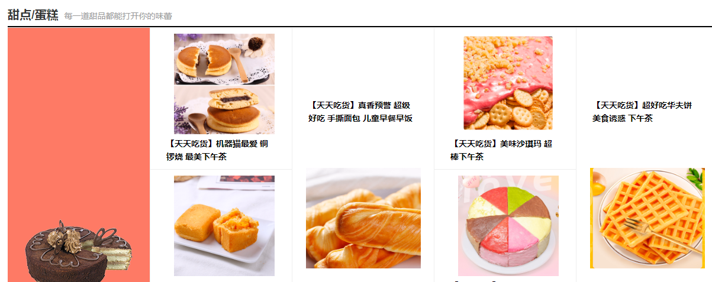
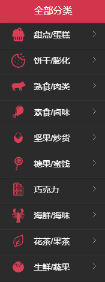

# 前端url

## 登录注册控制：/passprot

### 是否存在用户：

/usernameIsExist方式：GET	参数：username

```json
// http://localhost:8089/passport/usernameIsExist?username=s

{
  "status": 200,
  "msg": "OK",
  "data": null,
  "ok": true
}
```

### 登录：/login方式：

POST	参数userBO对象

```java

```

### 注册：/regist方式：

POST	参数userBO

```java

```

### 退出登录：/logout方式：

POST	参数userId

## index界面【首页】/index

### 获得各个分类下的最新6个商品：

/sixNewItems/{rootCatId}方式：GET	参数：rootCatId

```json
// 20200410095900
// http://localhost:8089/index/sixNewItems/1

{
  "status": 200,
  "msg": "OK",
  "data": [
    {
      "rootCatId": 1,
      "rootCatName": "甜点/蛋糕",
      "slogan": "每一道甜品都能打开你的味蕾",
      "catImage": "http://122.152.205.72:88/foodie/category/cake.png",
      "bgColor": "#fe7a65",
      "simpleItemList": [
        {
          "itemId": "cake-1001",
          "itemName": "【天天吃货】真香预警 超级好吃 手撕面包 儿童早餐早饭",
          "itemUrl": "http://122.152.205.72:88/foodie/cake-1001/img1.png"
        },
        {
          "itemId": "cake-1002",
          "itemName": "【天天吃货】网红烘焙蛋糕 好吃的蛋糕",
          "itemUrl": "http://122.152.205.72:88/foodie/cake-1002/img1.png"
        },
        {
          "itemId": "cake-1003",
          "itemName": "【天天吃货】超好吃华夫饼 美食诱惑 下午茶",
          "itemUrl": "http://122.152.205.72:88/foodie/cake-1003/img1.png"
        },
        {
          "itemId": "cake-1004",
          "itemName": "【天天吃货】美味沙琪玛 超棒下午茶",
          "itemUrl": "http://122.152.205.72:88/foodie/cake-1004/img1.png"
        },
        {
          "itemId": "cake-1005",
          "itemName": "【天天吃货】进口美食凤梨酥",
          "itemUrl": "http://122.152.205.72:88/foodie/cake-1005/img1.png"
        },
        {
          "itemId": "cake-1006",
          "itemName": "【天天吃货】机器猫最爱 铜锣烧 最美下午茶",
          "itemUrl": "http://122.152.205.72:88/foodie/cake-1006/img1.png"
        },
        {
          "itemId": "cake-37",
          "itemName": "好吃蛋糕甜点蒸蛋糕",
          "itemUrl": "http://122.152.205.72:88/foodie/cake-37/img1.png"
        },
        {
          "itemId": "cake-38",
          "itemName": "好吃蛋糕甜点软面包",
          "itemUrl": "http://122.152.205.72:88/foodie/cake-38/img1.png"
        },
        {
          "itemId": "cake-39",
          "itemName": "好吃蛋糕甜点脱水蛋糕",
          "itemUrl": "http://122.152.205.72:88/foodie/cake-39/img1.png"
        },
        {
          "itemId": "cake-42",
          "itemName": "好吃蛋糕甜点脱水蛋糕",
          "itemUrl": "http://122.152.205.72:88/foodie/cake-42/img1.png"
        },
        {
          "itemId": "cake-44",
          "itemName": "好吃蛋糕甜点软面包",
          "itemUrl": "http://122.152.205.72:88/foodie/cake-44/img1.png"
        },
        {
          "itemId": "cake-47",
          "itemName": "好吃鸡蛋卷 来自日本进口",
          "itemUrl": "http://122.152.205.72:88/foodie/cake-47/img1.png"
        },
        {
          "itemId": "cake-48",
          "itemName": "好吃蛋饼 来自日本进口",
          "itemUrl": "http://122.152.205.72:88/foodie/cake-48/img1.png"
        }
      ]
    }
  ],
  "ok": true
}
```



### 轮播图：

/carousel方式：GET	参数：

```json
// 20200410100202
// http://localhost:8089/index/carousel

{
  "status": 200,
  "msg": "OK",
  "data": [
    {
      "id": "c-10011",
      "imageUrl": "http://122.152.205.72:88/group1/M00/00/05/CpoxxF0ZmG-ALsPRAAEX2Gk9FUg848.png",
      "backgroundColor": "#f44661",
      "itemId": "nut-1004",
      "catId": "",
      "type": 1,
      "sort": 1,
      "isShow": 1,
      "createTime": "2019-08-27T12:33:06.000+0000",
      "updateTime": "2019-08-24T12:33:09.000+0000"
    },
    {
      "id": "c-10013",
      "imageUrl": "http://122.152.205.72:88/group1/M00/00/05/CpoxxF0ZmHiAWwR7AAFdqZHw8jU876.png",
      "backgroundColor": "#000240",
      "itemId": "",
      "catId": "51",
      "type": 2,
      "sort": 2,
      "isShow": 1,
      "createTime": "2019-08-25T12:33:06.000+0000",
      "updateTime": "2019-08-25T12:33:09.000+0000"
    },
    {
      "id": "c-10015",
      "imageUrl": "http://122.152.205.72:88/group1/M00/00/05/CpoxxF0ZmHuAPlXvAAFe-H5_-Nw961.png",
      "backgroundColor": "#ff9801",
      "itemId": "cake-1006",
      "catId": "",
      "type": 1,
      "sort": 3,
      "isShow": 1,
      "createTime": "2019-08-26T12:33:06.000+0000",
      "updateTime": "2019-08-26T12:33:09.000+0000"
    },
    {
      "id": "c-10021",
      "imageUrl": "http://122.152.205.72:88/group1/M00/00/05/CpoxxF0ZmH6AeuRrAAEZviPhyQ0768.png",
      "backgroundColor": "#55be59",
      "itemId": "",
      "catId": "133",
      "type": 2,
      "sort": 4,
      "isShow": 1,
      "createTime": "2019-08-28T12:33:06.000+0000",
      "updateTime": "2019-08-28T12:33:09.000+0000"
    }
  ],
  "ok": true
}
```

### 商品分类 - 大分类：

/cats方式：GET	参数：空

```json
// 20200417151137
// http://api.z.mukewang.com:8088/foodie-dev-api/index/cats

{
  "status": 200,
  "msg": "OK",
  "data": [
    {
      "id": 1,
      "name": "甜点/蛋糕",
      "type": 1,
      "fatherId": 0,
      "logo": "img/cake.png",
      "slogan": "每一道甜品都能打开你的味蕾",
      "catImage": "http://122.152.205.72:88/foodie/category/cake.png",
      "bgColor": "#fe7a65"
    },
    {
      "id": 2,
      "name": "饼干/膨化",
      "type": 1,
      "fatherId": 0,
      "logo": "img/cookies.png",
      "slogan": "嘎嘣脆，一听到声音就开吃",
      "catImage": "http://122.152.205.72:88/foodie/category/cookies.png",
      "bgColor": "#f59cec"
    },
    {
      "id": 3,
      "name": "熟食/肉类",
      "type": 1,
      "fatherId": 0,
      "logo": "img/meat.png",
      "slogan": "食肉者最爱绝佳美食",
      "catImage": "http://122.152.205.72:88/foodie/category/meat.png",
      "bgColor": "#b474fe"
    },
    {
      "id": 4,
      "name": "素食/卤味",
      "type": 1,
      "fatherId": 0,
      "logo": "img/luwei.png",
      "slogan": "香辣甜辣麻辣，辣了才有味",
      "catImage": "http://122.152.205.72:88/foodie/category/duck.png",
      "bgColor": "#82ceff"
    },
    {
      "id": 5,
      "name": "坚果/炒货",
      "type": 1,
      "fatherId": 0,
      "logo": "img/jianguo.png",
      "slogan": "酥脆无比，休闲最佳",
      "catImage": "http://122.152.205.72:88/foodie/category/nut.png",
      "bgColor": "#c6a868"
    },
    {
      "id": 6,
      "name": "糖果/蜜饯",
      "type": 1,
      "fatherId": 0,
      "logo": "img/sweet.png",
      "slogan": "甜味是爱美者的最爱",
      "catImage": "http://122.152.205.72:88/foodie/category/mango.png",
      "bgColor": "#6bdea7"
    },
    {
      "id": 7,
      "name": "巧克力",
      "type": 1,
      "fatherId": 0,
      "logo": "img/chocolate.png",
      "slogan": "美容养颜，男女都爱",
      "catImage": "http://122.152.205.72:88/foodie/category/chocolate.png",
      "bgColor": "#f8c375"
    },
    {
      "id": 8,
      "name": "海鲜/海味",
      "type": 1,
      "fatherId": 0,
      "logo": "img/lobster.png",
      "slogan": "吃货们怎么能少了海鲜呢？",
      "catImage": "http://122.152.205.72:88/foodie/category/crab.png",
      "bgColor": "#84affe"
    },
    {
      "id": 9,
      "name": "花茶/果茶",
      "type": 1,
      "fatherId": 0,
      "logo": "img/tea.png",
      "slogan": "绿茶红茶怎能少得了",
      "catImage": "http://122.152.205.72:88/foodie/category/tea.png",
      "bgColor": "#ff9229"
    },
    {
      "id": 10,
      "name": "生鲜/蔬果",
      "type": 1,
      "fatherId": 0,
      "logo": "img/food.png",
      "slogan": "新鲜少不了，每日蔬果生鲜",
      "catImage": "http://122.152.205.72:88/foodie/category/meat2.png",
      "bgColor": "#6cc67c"
    }
  ]
}
```



### 根据root分类id查询该分类下的所有子分类：

/subCat方式：GET	参数：id

```json
// 20200417151812
// http://api.z.mukewang.com:8088/foodie-dev-api/index/subCat/1

{
  "status": 200,
  "msg": "OK",
  "data": [
    {
      "id": 11,
      "name": "蛋糕",
      "type": "2",
      "fatherId": 1,
      "subCatList": [
        {
          "subId": 37,
          "subName": "蒸蛋糕",
          "subType": "3",
          "subFatherId": 11
        },
        {
          "subId": 38,
          "subName": "软面包",
          "subType": "3",
          "subFatherId": 11
        },
        {
          "subId": 39,
          "subName": "脱水蛋糕",
          "subType": "3",
          "subFatherId": 11
        },
        {
          "subId": 40,
          "subName": "马卡龙",
          "subType": "3",
          "subFatherId": 11
        },
        {
          "subId": 41,
          "subName": "甜甜圈",
          "subType": "3",
          "subFatherId": 11
        },
        {
          "subId": 42,
          "subName": "三明治",
          "subType": "3",
          "subFatherId": 11
        },
        {
          "subId": 43,
          "subName": "铜锣烧",
          "subType": "3",
          "subFatherId": 11
        }
      ]
    },
    {
      "id": 12,
      "name": "点心",
      "type": "2",
      "fatherId": 1,
      "subCatList": [
        {
          "subId": 44,
          "subName": "肉松饼",
          "subType": "3",
          "subFatherId": 12
        },
        {
          "subId": 45,
          "subName": "华夫饼",
          "subType": "3",
          "subFatherId": 12
        },
        {
          "subId": 46,
          "subName": "沙琪玛",
          "subType": "3",
          "subFatherId": 12
        },
        {
          "subId": 47,
          "subName": "鸡蛋卷",
          "subType": "3",
          "subFatherId": 12
        },
        {
          "subId": 48,
          "subName": "蛋饼",
          "subType": "3",
          "subFatherId": 12
        },
        {
          "subId": 49,
          "subName": "凤梨酥",
          "subType": "3",
          "subFatherId": 12
        },
        {
          "subId": 50,
          "subName": "手撕面包",
          "subType": "3",
          "subFatherId": 12
        }
      ]
    }
  ]
}
```

## item商品详情/items

### 商品评价等级数量：

/commentLevel?itemId方式：GET	参数：itemId

等级说明：1为好、2为一般、3为坏

```json
// 20200417160020
// http://api.z.mukewang.com:8088/foodie-dev-api/items/commentLevel?itemId=cake-1001

{
  "status": 200,
  "msg": "OK",
  "data": {
    "totalCounts": 23,
    "goodCounts": 14,
    "normalCounts": 7,
    "badCounts": 2
  }
}
```

### 评论分页：

/comments?itemId=&level=&page=&pageSize=方式：GET	参数：itemId、level、page、pageSize

```json
// 20200417155732
// http://api.z.mukewang.com:8088/foodie-dev-api/items/comments?itemId=cake-1001&level=&page=1&pageSize=10

{
  "status": 200,
  "msg": "OK",
  "data": {
    "page": 1,
    "total": 3,
    "records": 23,
    "rows": [
      {
        "commentLevel": 1,
        "content": "很棒",
        "specName": "草莓味",
        "createdTime": "2019-07-22T01:55:05.000+0000",
        "userFace": "http://api.z.mukewang.com:8088/foodie-dev-api/foodie/faces/1908189H7TNWDTXP/face-1908189H7TNWDTXP.jpg?t=20200104011001",
        "nickname": "ha******123"
      },
      {
        "commentLevel": 2,
        "content": "very good",
        "specName": "草莓味",
        "createdTime": "2019-07-22T01:55:05.000+0000",
        "userFace": "http://api.z.mukewang.com:8088/foodie-dev-api/foodie/faces/1908017YR51G1XWH/face-1908017YR51G1XWH.png?t=20200413224415",
        "nickname": "qq：******7149"
      },
      {
        "commentLevel": 3,
        "content": "非常好吃",
        "specName": "香草味",
        "createdTime": "2019-07-22T01:55:05.000+0000",
        "userFace": "http://api.z.mukewang.com:8088/foodie-dev-api/foodie/faces/1908189H7TNWDTXP/face-1908189H7TNWDTXP.jpg?t=20200104011001",
        "nickname": "ha******123"
      },
      {
        "commentLevel": 1,
        "content": "非常不错！~",
        "specName": "香草味",
        "createdTime": "2019-07-22T01:55:05.000+0000",
        "userFace": "http://api.z.mukewang.com:8088/foodie-dev-api/foodie/faces/1908017YR51G1XWH/face-1908017YR51G1XWH.png?t=20200413224415",
        "nickname": "qq：******7149"
      },
      {
        "commentLevel": 2,
        "content": "非常好吃",
        "specName": "香草味",
        "createdTime": "2019-07-22T01:55:05.000+0000",
        "userFace": "http://api.z.mukewang.com:8088/foodie-dev-api/foodie/faces/1908189H7TNWDTXP/face-1908189H7TNWDTXP.jpg?t=20200104011001",
        "nickname": "ha******123"
      },
      {
        "commentLevel": 2,
        "content": "非常好吃",
        "specName": "香草味",
        "createdTime": "2019-07-22T01:55:05.000+0000",
        "userFace": "http://api.z.mukewang.com:8088/foodie-dev-api/foodie/faces/1908017YR51G1XWH/face-1908017YR51G1XWH.png?t=20200413224415",
        "nickname": "qq：******7149"
      },
      {
        "commentLevel": 1,
        "content": "非常好吃",
        "specName": "原味",
        "createdTime": "2019-07-22T01:55:05.000+0000",
        "userFace": "http://api.z.mukewang.com:8088/foodie-dev-api/foodie/faces/1908189H7TNWDTXP/face-1908189H7TNWDTXP.jpg?t=20200104011001",
        "nickname": "ha******123"
      },
      {
        "commentLevel": 1,
        "content": "非常好吃",
        "specName": "香草味",
        "createdTime": "2019-07-22T01:55:05.000+0000",
        "userFace": "http://api.z.mukewang.com:8088/foodie-dev-api/foodie/faces/1908017YR51G1XWH/face-1908017YR51G1XWH.png?t=20200413224415",
        "nickname": "qq：******7149"
      },
      {
        "commentLevel": 1,
        "content": "非常好吃",
        "specName": "原味",
        "createdTime": "2019-07-22T01:55:05.000+0000",
        "userFace": "http://api.z.mukewang.com:8088/foodie-dev-api/foodie/faces/1908189H7TNWDTXP/face-1908189H7TNWDTXP.jpg?t=20200104011001",
        "nickname": "ha******123"
      },
      {
        "commentLevel": 1,
        "content": "非常好吃",
        "specName": "原味",
        "createdTime": "2019-07-22T01:55:05.000+0000",
        "userFace": "http://api.z.mukewang.com:8088/foodie-dev-api/foodie/faces/1908017YR51G1XWH/face-1908017YR51G1XWH.png?t=20200413224415",
        "nickname": "qq：******7149"
      }
    ]
  }
}
```

### 商品详细信息：

/info/{itemId}方式：GET	参数：itemId

```json
// 20200410095623
// http://localhost:8089/items/info/cake-1002

{
  "status": 200,
  "msg": "OK",
  "data": {
    "item": {
      "id": "cake-1002",
      "itemName": "【天天吃货】网红烘焙蛋糕 好吃的蛋糕",
      "catId": 37,
      "rootCatId": 1,
      "sellCounts": 363,
      "onOffStatus": 1,
      "createdTime": "2019-09-09T06:45:34.000+0000",
      "updatedTime": "2019-09-09T06:45:38.000+0000",
      "content": "<p>超级好吃、非常好吃</p>"
    },
    "itemImgList": [
      {
        "id": "4",
        "itemId": "cake-1002",
        "url": "http://122.152.205.72:88/foodie/cake-1002/img1.png",
        "sort": 0,
        "isMain": 1,
        "createdTime": "2019-07-01T06:46:55.000+0000",
        "updatedTime": "2019-07-01T06:47:02.000+0000"
      },
      {
        "id": "5",
        "itemId": "cake-1002",
        "url": "http://122.152.205.72:88/foodie/cake-1002/img2.png",
        "sort": 1,
        "isMain": 0,
        "createdTime": "2019-07-01T06:46:55.000+0000",
        "updatedTime": "2019-07-01T06:47:02.000+0000"
      }
    ],
    "itemParams": {
      "id": "2",
      "itemId": "cake-1002",
      "producPlace": "中国",
      "footPeriod": "180天",
      "brand": "慕课网",
      "factoryName": "北京慕课网有限公司",
      "factoryAddress": "北京中关村",
      "packagingMethod": "袋装",
      "weight": "50g",
      "storageMethod": "常温5~25°",
      "eatMethod": "拆开即食",
      "createdTime": "2019-07-01T07:32:30.000+0000",
      "updatedTime": "2019-07-01T07:32:35.000+0000"
    },
    "itemSpecList": [
      {
        "id": "4",
        "itemId": "cake-1002",
        "name": "巧克力",
        "stock": 242,
        "discounts": 0.90,
        "priceDiscount": 36000,
        "priceNormal": 40000,
        "createdTime": "2019-07-01T06:54:20.000+0000",
        "updatedTime": "2019-07-01T06:54:28.000+0000"
      },
      {
        "id": "5",
        "itemId": "cake-1002",
        "name": "草莓水果",
        "stock": 302,
        "discounts": 0.80,
        "priceDiscount": 32000,
        "priceNormal": 40000,
        "createdTime": "2019-07-01T06:54:20.000+0000",
        "updatedTime": "2019-07-01T06:54:28.000+0000"
      },
      {
        "id": "6",
        "itemId": "cake-1002",
        "name": "芒果口味",
        "stock": 194,
        "discounts": 1.00,
        "priceDiscount": 40000,
        "priceNormal": 40000,
        "createdTime": "2019-07-01T06:54:20.000+0000",
        "updatedTime": "2019-07-01T06:54:28.000+0000"
      }
    ]
  },
  "ok": true
}
```

### 搜索：

/search?keywords&sort=&page&pageSize=方式：GET	参数：keywords、sort、page、pageSize

```json
// 20200410100923
// http://localhost:8089/items/search?keywords=%E9%A5%BC%E5%B9%B2&sort=k&page=1&pageSize=20

{
  "status": 200,
  "msg": "OK",
  "data": {
    "total": 1,
    "records": 12,
    "page": 1,
    "rows": [
      {
        "imgUrl": "http://122.152.205.72:88/foodie/bingan-1003/img1.png",
        "itemId": "bingan-1003",
        "itemName": "【天天吃货】可爱动物饼干 儿童早餐 孩子最爱",
        "sellCounts": 868,
        "price": 8000
      },
      {
        "imgUrl": "http://122.152.205.72:88/foodie/bingan-1002/img1.png",
        "itemId": "bingan-1002",
        "itemName": "【天天吃货】男人最爱 秋葵饼干 嘎嘣脆",
        "sellCounts": 424,
        "price": 10000
      },
      {
        "imgUrl": "http://122.152.205.72:88/foodie/cookies-59/img1.png",
        "itemId": "cookies-59",
        "itemName": "【天天吃货】儿童饼干 早餐必备",
        "sellCounts": 1949,
        "price": 12000
      },
      {
        "imgUrl": "http://122.152.205.72:88/foodie/cookies-53/img1.png",
        "itemId": "cookies-53",
        "itemName": "【天天吃货】儿童饼干 成人饼干 趣趣闲闲",
        "sellCounts": 2949,
        "price": 12800
      },
      {
        "imgUrl": "http://122.152.205.72:88/foodie/cookies-52/img1.png",
        "itemId": "cookies-52",
        "itemName": "夹心饼干美味下午茶",
        "sellCounts": 3308,
        "price": 14000
      },
      {
        "imgUrl": "http://122.152.205.72:88/foodie/cookies-57/img1.png",
        "itemId": "cookies-57",
        "itemName": "好吃下午茶曲奇饼干",
        "sellCounts": 3093,
        "price": 15600
      },
      {
        "imgUrl": "http://122.152.205.72:88/foodie/cookies-51/img1.png",
        "itemId": "cookies-51",
        "itemName": "嘎嘣脆酥酥麻麻饼干 休闲食品下午茶最爱",
        "sellCounts": 3608,
        "price": 16400
      },
      {
        "imgUrl": "http://122.152.205.72:88/foodie/cookies-54/img1.png",
        "itemId": "cookies-54",
        "itemName": "甜甜美食饼干 儿童最爱",
        "sellCounts": 1288,
        "price": 17200
      },
      {
        "imgUrl": "http://122.152.205.72:88/foodie/cookies-56/img1.png",
        "itemId": "cookies-56",
        "itemName": "甜甜美食饼干 儿童最爱",
        "sellCounts": 3688,
        "price": 17200
      },
      {
        "imgUrl": "http://122.152.205.72:88/foodie/cookies-63/img1.png",
        "itemId": "cookies-63",
        "itemName": "超级好吃巧克力威化饼干 女女最爱",
        "sellCounts": 1230,
        "price": 17200
      },
      {
        "imgUrl": "http://122.152.205.72:88/foodie/cookies-55/img1.png",
        "itemId": "cookies-55",
        "itemName": "超级好吃巧克力威化饼干 女女最爱",
        "sellCounts": 2330,
        "price": 18000
      },
      {
        "imgUrl": "http://122.152.205.72:88/foodie/cookies-58/img1.png",
        "itemId": "cookies-58",
        "itemName": "【天天吃货】无糖者最爱无糖饼干 酥酥脆脆",
        "sellCounts": 2399,
        "price": 21200
      }
    ]
  },
  "ok": true
}
```


### 侧导航栏物品类：

/catItems?catId=&sort=&page=&pageSize=方式：GET	参数：catId、sort、page、pageSize

```json
// 20200410101501
// http://api.z.mukewang.com:8088/foodie-dev-api/items/catItems?catId=104&sort=k&page=1&pageSize=20

{
  "status": 200,
  "msg": "OK",
  "data": {
    "page": 1,
    "total": 1,
    "records": 7,
    "rows": [
      {
        "itemId": "nut-1002",
        "itemName": "【天天吃货】农家锅巴 农家乐 有机菜",
        "sellCounts": 369,
        "imgUrl": "http://122.152.205.72:88/foodie/nut-1002/img1.png",
        "price": 4480
      },
      {
        "itemId": "nut-1004",
        "itemName": "【天天吃货】进口核桃 养生补脑最佳零食",
        "sellCounts": 751,
        "imgUrl": "http://122.152.205.72:88/foodie/nut-1004/img1.png",
        "price": 5440
      },
      {
        "itemId": "nut-1003",
        "itemName": "【天天吃货】进口碧根果 养生补脑最佳零食",
        "sellCounts": 1038,
        "imgUrl": "http://122.152.205.72:88/foodie/nut-1003/img1.png",
        "price": 5040
      },
      {
        "itemId": "nut-1001",
        "itemName": "【天天吃货】进口美国松子 口味齐全",
        "sellCounts": 359,
        "imgUrl": "http://122.152.205.72:88/foodie/nut-1001/img1.png",
        "price": 3360
      },
      {
        "itemId": "nut-1005",
        "itemName": "【天天吃货】野生开心果 养生补脑最佳零食",
        "sellCounts": 953,
        "imgUrl": "http://122.152.205.72:88/foodie/nut-1005/img1.png",
        "price": 7680
      },
      {
        "itemId": "nut-1006",
        "itemName": "【天天吃货】野生腰果 养生补脑最佳零食",
        "sellCounts": 560,
        "imgUrl": "http://122.152.205.72:88/foodie/nut-1006/img1.png",
        "price": 4640
      },
      {
        "itemId": "nut-104",
        "itemName": "进口坚果大杂烩 好吃又回味",
        "sellCounts": 5252,
        "imgUrl": "http://122.152.205.72:88/foodie/nut-104/img1.png",
        "price": 5760
      }
    ]
  }
}
```


### 购物车刷新：

/refresh?itemSpecIds=方式：GET	参数：itemSpecIds	拼接规则：itemSpecIds=1,3,4

```json
// 20200413113941
// http://localhost:8089/items/refresh?itemSpecIds=1,3,4

{
  "status": 200,
  "msg": "OK",
  "data": [
    {
      "specId": "1",
      "itemId": "cake-1001",
      "itemName": "【天天吃货】真香预警 超级好吃 手撕面包 儿童早餐早饭",
      "specName": "原味",
      "priceNormal": 20000,
      "itemImgUrl": "http://122.152.205.72:88/foodie/cake-1001/img1.png",
      "priceDiscount": 18000
    },
    {
      "specId": "3",
      "itemId": "cake-1001",
      "itemName": "【天天吃货】真香预警 超级好吃 手撕面包 儿童早餐早饭",
      "specName": "香草味",
      "priceNormal": 20000,
      "itemImgUrl": "http://122.152.205.72:88/foodie/cake-1001/img1.png",
      "priceDiscount": 17600
    },
    {
      "specId": "4",
      "itemId": "cake-1002",
      "itemName": "【天天吃货】网红烘焙蛋糕 好吃的蛋糕",
      "specName": "巧克力",
      "priceNormal": 40000,
      "itemImgUrl": "http://122.152.205.72:88/foodie/cake-1002/img1.png",
      "priceDiscount": 36000
    }
  ],
  "ok": true
}
```

## 购物车添加/shopcart

[需要redis]

### 加入购物车

：/add?userId方式：POST	参数userId、shopcartItem

```json

```

### 从购物车中删除商品

：/del?userId=&itemSpecId=方式：POST	参数：userId、itemSpecId

```json

```

## 订单相关/orders

创建订单：

/create方式：POST	参数：userId、itemSpecIds、addressId、payMethod、leftMsg

```json

```

发起请求获得微信支付扫描二维码

/getPaidOrderInfo方式：POST	参数：orderId

## 地址相关/address

### 删除地址信息：

/delete?userId=&addressId=方式：POST	参数：userId、addressId

```json

```

### 设置默认地址：

/setDefalut?userId=&addressId=方式：POST	参数：userId、addressId

```json

```

### 添加地址信息：

/add方式：POST	参数：userId、receiver、mobile、province、city、district、detail

```json
{
  "status": 200,
  "msg": "OK",
  "data": null
}
```

### 更新地址信息：

/update方式：POST	参数：addressId、userId、receiver、mobile、province、city、district、detail

```json

```

### 获取地址列表：

/list?userId=方式：POST	参数：userId

```json
{
  "status": 200,
  "msg": "OK",
  "data": [
    {
      "id": "200413A99Y4MD11P",
      "userId": "fb0d3712-ee9a-4425-816e-bc11973d2ad6",
      "receiver": "xxx",
      "mobile": "15114523421",
      "province": "北京",
      "city": "北京",
      "district": "东城区",
      "detail": "xxxx",
      "extand": null,
      "isDefault": 1,
      "createdTime": "2020-04-13T06:28:47.000+0000",
      "updatedTime": "2020-04-13T06:28:47.000+0000"
    }
  ]
}
```

